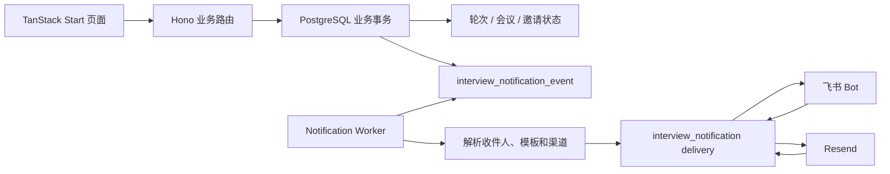
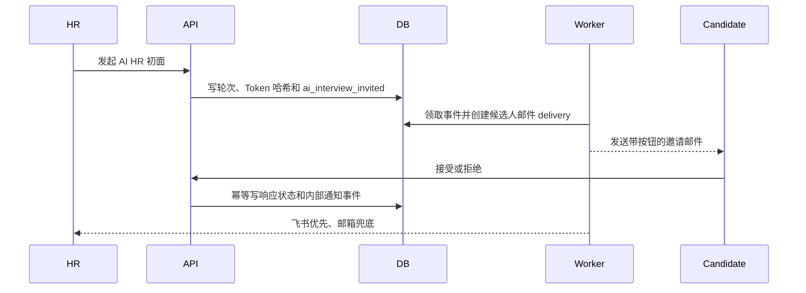
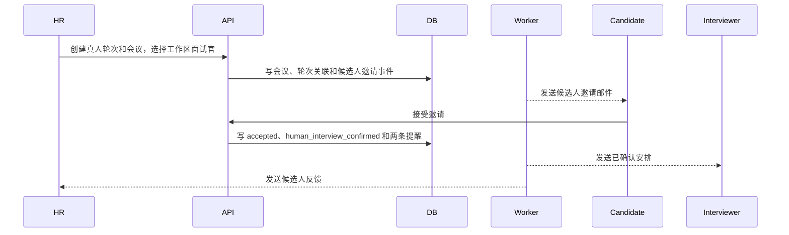

# 面试通知全流程技术设计

> 状态：Phase 1 核心闭环已实现并按 2026-08-26 最终产品口径收口
>
> 产品依据：[面试通知全流程 PRD](../product/2026-08-18-interview-notification-flow-prd.md)
>
> 技术边界：TanStack Start Web、Hono Backend、PostgreSQL/Drizzle、Notification Worker、飞书 Bot、Resend

## 1. 最终设计结论

本期采用“业务事务写事件 outbox，独立 Worker 解析并发送”的方案，不在业务请求内同步调用飞书或邮件供应商。

最终产品口径如下：

1. AI HR 初面固定为第一轮；之后仅已完成且通过的真人面试占用第二、第三……轮。
2. 候选人没有飞书账号，本期只通过邮件和带有效期的公开链接接收邀请、改期、取消和提醒。
3. AI 流程内部收件人可以显式选择；未选择时回退到 AI 轮次发起人。
4. 真人流程不选择额外 HR 通知人员，内部 HR 永远取会议 `createdBy`。
5. 真人面试官必须是工作区已有 `user`/`member`，会议和轮次使用现有关联表保存具体用户。
6. 列表外同事复用工作区邀请：邮箱可选；也可以只生成链接，由 HR 自行转发。
7. HR 保存排期表示已经与面试官协调时间。候选人接受后直接通知 `createdBy` 和全部面试官，不存在面试官二次确认。
8. 本期只有具备真人面试更新权限的 HR 可以改期或取消；候选人和面试官只接收结果通知。
9. 会议结束只关闭入会能力并取消未发送提醒；HR 标记真人轮次完成后才生成累计评价通知。
10. 真人评价汇总只发给会议 `createdBy`，不发给面试官。
11. 飞书账号可用时内部通知优先飞书；没有飞书绑定但账号有有效邮箱时回退邮件。
12. 短信类型只作为兼容枚举保留，本期不创建短信 delivery，也不接入短信供应商。

## 2. 架构与事务边界



### 2.1 不变量

- 业务状态和通知事件在同一个数据库事务内提交。
- 外部网络调用不发生在业务事务或数据库行锁期间。
- 事件保存渲染所需业务快照，Worker 不根据未来可变状态重建历史文案。
- `dedupeKey` 唯一，接口重试不能重复创建同一业务事件。
- delivery 的 `(event, channel, recipient)` 唯一，供应商请求使用稳定的 `providerRequestKey`。
- 候选人不会进入飞书 Open ID 解析。
- 内部账号的渠道回退只发生在该账号内，不会把消息转发给另一个人。
- 改期增加 `scheduleVersion`，取消旧版本待发提醒，再创建新版本提醒。
- 候选人拒绝真人邀请时不通知面试官。
- 候选人接受真人邀请后不等待面试官响应，直接产生正式安排和提醒事件。

## 3. 身份与权限边界

| 概念                | 作用                           | 权限结果                 |
| ------------------- | ------------------------------ | ------------------------ |
| `user` / account    | 登录和通知身份                 | 本身不授予候选人库权限   |
| `member`            | 用户属于某个工作区             | 按工作区角色授予产品权限 |
| 轮次/会议面试官关联 | 参与某轮或某场真人面试         | 仅用于本次面试运行和通知 |
| `createdBy`         | 创建本次 AI 轮次或真人会议的人 | 用于审计和内部通知兜底   |

本期不新增角色中心，也不新增独立外部面试官身份。面试官必须先通过现有工作区邀请成为成员，再由 HR 在排期弹窗刷新列表并显式选择。加入工作区不会自动绑定到任何候选人或会议。

真人面试官公开会议链接仍是 `/human-interview/interviewer/:inviteToken`。该链接只代表已经选中的现有用户对本场会议的访问关系，不是加入工作区的邀请，也不提供确认、拒绝或改期操作。

## 4. 数据模型

### 4.1 候选人邀请状态

AI 轮次在 `studio_interview_schedule` 保存：

- `candidateInviteStatus`
- `candidateInviteTokenHash`
- `candidateInviteExpiresAt`
- `candidateRespondedAt`
- `candidateDeclineReason`
- `invitationVersion`

真人会议按候选人轮次在 `studio_human_interview_meeting_round` 保存同类字段。Token 原文不入库，只存哈希；新版本邀请使旧链接失效。

### 4.2 真人排期版本

`studio_human_interview_meeting.scheduleVersion` 从 1 开始。改期在同一会议记录上递增版本，不创建伪造的新业务轮次。

轮次本身由 `studio_human_interview_round` 表示：

- `pending`：尚未由 HR 标记完成；
- `completed`：HR 已提交结果；
- `cancelled`：本次记录已取消，不占后续成功业务轮次。

轮次标签是展示事实。通知中的当前轮次名和上一轮名称来自实际业务记录，不通过数据库记录条数硬编码。

### 4.3 通知事件 outbox

`interview_notification_event` 保存：

- 组织、事件类型和作用域；
- 候选人、AI 轮次、真人会议、真人轮次或会话关联；
- 操作人和稳定去重键；
- `payloadSnapshot`；
- `availableAt` / `nextAttemptAt`；
- `pending | processing | completed | failed | dead | cancelled`；
- 租约、尝试次数和最后错误。

事件由 owning DAO 在业务事务中创建。创建事件的公共入口位于：

```text
apps/server/src/server/routes/studio/routes/interview-notifications/utils/events.ts
```

其中 `resolveHumanMeetingEventInterviewLink()` 统一真人事件的链接策略：真人完成评价直接链接招聘系统记录页；候选人相关事件才要求有效邀请 Token。评价事件因此不依赖邀请签名密钥。

### 4.4 Delivery

现有 `interview_notification` 扩展为具体渠道发送记录，保存：

- `eventId`
- `channel`
- `audienceType`
- 最终接收地址和显示名
- 模板版本
- 渲染后的标题和正文
- 供应商请求键和消息 ID
- `pending | sending | sent | failed | dead | unknown | cancelled`
- 重试时间、租约和错误信息

旧 AI 报告通知字段继续兼容，不要求一次性回填历史数据。

### 4.5 模板

`interview_notification_template` 表示工作区或系统默认模板；`interview_notification_template_version` 保存不可变发布版本。每次 delivery 固定模板版本和渲染快照，后续修改模板不会改变历史发送内容。

Phase 1 使用迁移内置模板。工作区模板编辑、预览、测试和发布页面属于后续范围。

### 4.6 AI 显式通知人员

`studio_interview_notification_recipient` 只用于 AI 流程的显式内部人员选择。列表为空时回退 AI 轮次 `createdBy`，旧数据才回退候选人记录 `createdBy`。

真人会议不读取该表，始终使用会议 `createdBy`。

### 4.7 未新增的数据结构

本期明确不新增：

- 通用角色或角色绑定表；
- 独立 `interviewer_assignment` 表；
- 专用列表外面试官邀请表；
- 面试官专用注册/邮箱匹配页面；
- 候选人或面试官改期提议状态机。

## 5. 事件与收件人

| 事件                                   | 候选人             | 面试官             | 内部 HR               |
| -------------------------------------- | ------------------ | ------------------ | --------------------- |
| `ai_interview_invited`                 | 邮件               | 无                 | 显式人员或发起人      |
| `ai_invitation_accepted`               | 页面结果           | 无                 | 显式人员或发起人      |
| `ai_invitation_declined`               | 页面结果           | 无                 | 显式人员或发起人      |
| `ai_invitation_exception`              | 页面错误 + 邮件    | 无                 | 显式人员或发起人告警  |
| `ai_interview_completed`               | 无                 | 无                 | 显式人员或发起人      |
| `ai_report_ready` / `ai_report_failed` | 无                 | 无                 | 显式人员或发起人      |
| `human_candidate_invitation_requested` | 邮件               | 无                 | 无                    |
| `human_invitation_accepted`            | 页面结果           | 无                 | 会议 `createdBy`      |
| `human_interview_confirmed`            | 可发送正式安排邮件 | 飞书优先、邮箱兜底 | 不重复通知            |
| `human_invitation_declined`            | 页面结果           | 无                 | 会议 `createdBy`      |
| `human_invitation_exception`           | 页面错误 + 邮件    | 无                 | 会议 `createdBy` 告警 |
| `human_interview_rescheduled`          | 邮件               | 飞书优先、邮箱兜底 | 会议 `createdBy`      |
| `human_interview_cancelled`            | 邮件               | 飞书优先、邮箱兜底 | 会议 `createdBy`      |
| `human_interview_reminder`             | 邮件               | 飞书优先、邮箱兜底 | 会议 `createdBy`      |
| `human_interview_completed`            | 无                 | 无                 | 仅会议 `createdBy`    |

共享类型仍保留少量历史事件枚举，以兼容已经应用过的开发迁移和历史 delivery；当前 UI 和业务路由不提供面试官确认/拒绝动作，也不会在新流程中生成这些事件。

## 6. 核心时序

### 6.1 AI 邀请



公开 API：

```text
GET  /api/public/ai-interview-invitations/:token
POST /api/public/ai-interview-invitations/:token/respond
```

已拒绝、已过期或已被新版本替换的邀请不能再开始 AI 面试。

### 6.2 真人排期与候选人接受



公开 API：

```text
GET  /api/public/human-interview-meetings/:inviteToken
POST /api/public/human-interview-meetings/:inviteToken/respond
POST /api/public/human-interview-meetings/:inviteToken/livekit-token

GET  /api/public/human-interview-meetings/interviewer/:inviteToken
POST /api/public/human-interview-meetings/interviewer/:inviteToken/livekit-token
POST /api/public/human-interview-meetings/interviewer/:inviteToken/end
```

没有面试官响应接口。面试官链接在会议允许进入时直接获取 LiveKit Token。

### 6.3 工作区邀请列表外同事

1. 排期弹窗打开现有 `InviteDialog`。
2. HR 可填写邮箱并发送邀请，也可不填邮箱只生成复制链接。
3. 同事访问 `/join/:code`，飞书登录并加入工作区。
4. 加入成功后系统通知邀请创建者。
5. HR 刷新成员列表并选择该用户。
6. 保存会议时才写轮次和会议的面试官关联。

该流程不会自动把工作区新成员加入当前会议，也不会创建第二套邀请 Token。

### 6.4 改期与取消

改期由 HR 更新原会议：

- `scheduleVersion + 1`；
- 保留候选人已接受事实；
- 取消旧版本待发提醒；
- 产生改期事件；
- 按新时间创建尚未错过的 T-24h 和 T-1h 提醒。

取消会议或轮次时：

- 标记业务状态；
- 禁止候选人和面试官继续入会；
- 取消未发送提醒；
- 给候选人、当前面试官和会议 `createdBy` 发送统一取消通知。

### 6.5 完成与累计评价

主持人结束会议只处理运行时会议和提醒，不发送评价汇总。

HR 调用轮次完成接口后，在 `completeHumanInterviewRound()` 的业务事务中创建 `human_interview_completed`。评价正文按成功轮次累计：

- AI HR 初面评价；
- 已完成且通过的第二轮真人评价；
- 已完成且通过的第三轮真人评价；
- 后续依次追加。

当前真人评价字段尚未接入结构化采集，因此按产品口径渲染“未收集到”。该事件只解析会议 `createdBy`，不解析面试官，也不要求候选人邀请 Token。

## 7. Worker、租约和重试

Worker 通过 `FOR UPDATE SKIP LOCKED` 分批领取事件和 delivery，并写入租约 owner/过期时间。外部发送完成后再更新数据库，不持有事务锁等待供应商。

失败重试间隔固定为：

```text
第 1 次失败后：1 分钟
第 2 次失败后：5 分钟
第 3 次失败后：15 分钟
```

- 明确永久错误进入 `dead`；
- 可重试错误按上表调度；
- 供应商结果无法判断时进入 `unknown`，不自动重复发送，避免重复通知；
- Worker 崩溃后由过期租约恢复未完成任务；
- 改期和取消会把旧提醒标记为 `cancelled`。

启动开关：

```text
INTERVIEW_NOTIFICATION_FLOW_ENABLED
INTERVIEW_NOTIFICATION_WORKER_ENABLED
```

业务开关控制是否创建新事件；Worker 开关控制当前进程是否消费事件。生产启用前必须先应用迁移并校验飞书和 Resend 配置。

## 8. 模板渲染和链接

模板变量由共享白名单校验，日期按事件 `timeZone` 格式化。邮件正文将 Markdown 链接渲染为按钮或可点击链接；飞书通过结构化卡片呈现标题、字段和操作入口。

候选人正文不包含内部状态、工作流字段、评价或面试官账号信息。取消、改期和提醒只展示候选人完成操作所需的信息。

面试官 delivery 在准备阶段解析该面试官专属会议链接；候选人 delivery 使用候选人专属邀请链接；HR 完成评价使用招聘系统候选人记录页。

## 9. Backend 模块归属

```text
apps/server/src/server/routes/studio/routes/
  interview-notifications/
    dao.ts
    utils/
      events.ts
      feature-flags.ts
      prepare-deliveries.ts
      recipient-policy.ts
      templates.ts
      notification-presentation.tsx
      channel-adapters.ts
  interviews/
    dao/
      ai-interview-candidate-response.ts
      ai-interview-invitation-access.ts
      human-interview-candidate-response.ts
      human-interview-confirmation-readiness.ts
      human-interview-meeting-cancellation.ts
      human-interview-meeting-schedule.ts
      human-interview-round-completion.ts
    routes/
      notification-recipients/
  workspace/routes/invite-links/
```

```text
apps/worker/src/interview-notifications/
  default-dependencies.ts
  processor.ts
  scheduler.ts
```

Web 页面继续把 `src/routes/` 限制为薄路由；排期、成员邀请、轮次和会议 UI 位于 `src/components/features/`。

## 10. 迁移范围

本次迁移以 additive 方式为主：

- 给 AI 和真人候选人邀请增加状态、哈希、响应时间和版本字段；
- 给真人会议增加 `scheduleVersion`；
- 新增 AI 显式通知人员、模板、模板版本和事件 outbox；
- 扩展现有 delivery 表；
- 增加去重、领取、查询所需索引及数据一致性约束；
- 内置并逐版更新系统默认模板。

迁移中的外键只约束本次新增通知事实与现有组织、用户、候选人、轮次和会议之间的归属关系；业务查询仍由 DAO 显式完成。未新增专用外部面试官表。

已在本地应用过的中间迁移保持向前兼容；最终代码不使用历史面试官确认入口。不要在发布过程中对本地或线上数据库执行破坏性 DROP 来清理开发期遗留表，清理应作为单独、可审计迁移处理。

## 11. 验证策略

聚焦验证覆盖：

- 事件去重和模板变量；
- 收件人解析与飞书/邮箱回退；
- AI 邀请接受、拒绝、过期、冲突和系统异常；
- 真人候选人邀请、直接确认、改期、取消和提醒；
- 真人轮次完成后的累计评价及 HR-only 收件人；
- 工作区邀请邮箱可选和加入后通知创建者；
- Worker 租约、1/5/15 重试、unknown/dead 和调度；
- 前端轮次编号、轮次标签、创建约束和复制链接交互；
- 迁移静态契约和三端 TypeScript typecheck。

本功能不依赖真实供应商发送作为自动测试前提；真实飞书和邮件发送只在已配置的本地环境做人工验收。

## 12. 后续范围

- 工作区通知模板编辑、预览、测试和发布 UI；
- dead/unknown 统一运营处理页；
- 短信供应商、签名、模板报备和安全短链；
- 面试官或候选人发起改期提议的协商状态机；
- 真人评价结构化采集与模板字段映射；
- 飞书会议参与人变更的补偿同步和运营重试入口。
