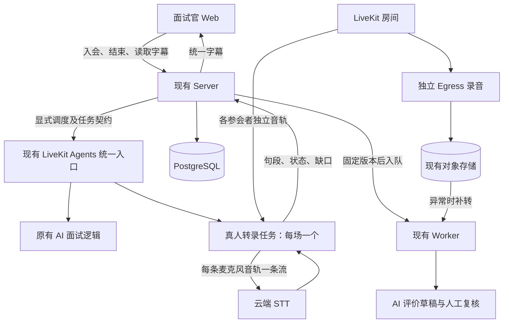
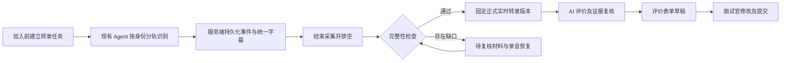

# 真人面试服务端实时转录方案

日期：2026-09-16

状态：本地端到端闭环已实现并验收（2026-09-18）；未提交、未发布到线上。生产灰度与容量验收见第 15 节。

修订：已纳入两轮审查，补齐收尾与退出时间、对照隔离、重连与去重、音轨监听、来源约束和待复核材料修订流程。

适用范围：应用内 LiveKit 真人面试；复用现有 LiveKit Agents 部署。

## 1. 决策与目标

在现有 Python LiveKit Agents 服务中增加真人面试转录任务。每场会议只运行一个有效采集任务，按授权参会者的麦克风音轨分别调用流式 STT。服务端持续保存转录，各面试官查看同一份字幕。结束后完成收尾并固定转录版本，直接接入现有真人面试 AI 评价。

正常会议不再执行整场会后转写。独立 LiveKit Egress 录音继续保留，供回听、缺口补转和严重故障恢复使用。

第一版复用现有容器部署、Python 运行环境和 STT 适配器；需要更新并重新发布现有服务，但不要求新增独立服务。性能容量通过测试确定，不预设现有机器还有足够余量。

主要收益：消除多面试官页面重复识别，实时阶段就保留身份，统一字幕与评价材料，缩短会后等待。识别准确率和总费用是否改善必须实测，不能仅从“迁移到服务端”推断。

本次不改变 AI 面试行为、招聘阶段和人工决策，不扩展外部飞书会议音频接入，也不改变 Echo/Meeting Buddy 的桌面本地录音流程。ADR-0028 的桌面 local-first 约束和 ADR-0038 的录音导入初试流程继续适用各自场景。

## 2. 现状与必须修正的假设

### 2.1 改造前的处理链

- 每个非旁听面试官页面具备音轨后自动启动两路 STT：自己的麦克风、全部远端参会者混音。
- 浏览器采集音频，经 Web 服务转发给识别供应商。授权租约不按会议共享或去重。
- H 位面试官各开一个正常页面时，可产生约 2H 路实时识别；同一句候选人回答可能被重复识别。
- 正式录音处理已支持按人分轨和证据归属，不能将现有正式转录描述为完全依赖混音猜身份。
- 正式转录发布后，真人面试评价直接读取完整转录、岗位说明、内部标准和简历，不依赖会议摘要先生成。
- 现有实时字幕恢复主要是兜底，不能不经改造直接升为正式材料来源。

### 2.2 同一部署承载两种业务的准确方式

本地锁定及安装的 `livekit-agents` 均为 1.7.1。实际 SDK 的 `AgentServer.rtc_session()` 只允许注册一个入口；不能在同一实例上再注册一个不同名称的入口。

第一版采用：**同一 AgentServer、同一 AGENT_NAME、一个入口，根据服务端调度元数据分流。**

- 保持 `apps/livekit-agent/src/agent.py` 为部署入口。
- 保持现有 AGENT_NAME，避免影响已部署的 AI 面试调度。
- 抽取统一入口，内部调用 `run_ai_interview()` 或 `run_human_transcription()`。
- 真人转录任务只处理音轨、STT 和字幕，不创建用于问答的 AgentSession，不启用 TTS 或提问模型。
- AI 面试原有元数据版本 2/3 继续按既有验证逻辑处理。空调度元数据只允许落到经过验证的历史 AI 面试路径；真人房间缺少有效任务契约时拒绝，不能误启动 AI 面试。
- 未知 kind、版本或工作区/房间绑定错误直接拒绝，不能默认为 AI 面试。
- 当前全局 prewarm 和结束回调需要审查：统一入口按任务类型处理，真人转录不产生 AI 面试报告或招聘状态更新；避免为纯转录无条件增加昂贵模型预热。
- 不依赖 AgentSession 的 `on_session_end` 生成真人转录产物。SDK 在没有 primary AgentSession 时跳过相关 session report 路径；真人转录使用显式收尾和 shutdown callback，并由服务端补偿未完成任务。

未来如需独立扩容，抽出的真人转录逻辑可以接到另一 AgentServer/调度名，再部署成独立服务；第一版不增加这项运维负担。

## 3. 架构与模块职责



| 模块                | 职责                                                                 |
| ------------------- | -------------------------------------------------------------------- |
| LiveKit             | 传输参会者音频，提供音轨及发布者身份                                 |
| Python 真人转录模块 | 订阅授权音轨、采样转换、独立 STT、临时文本、最终句段、断线恢复、收尾 |
| Server 真人面试模块 | 授权、调度、任务占用、身份映射、字幕持久化、版本发布、补救决策       |
| Web 真人面试模块    | 展示统一字幕、连接状态及缺口提示，发起结束；不再上传 STT 音频        |
| 现有 Egress         | 独立录音，继续提供回听和恢复材料                                     |
| 现有 Worker         | 任务状态补偿、必要的录音补转、AI 评价与通知                          |

Hono 负责控制与文字数据，不代理新方案的持续音频流。音频从 LiveKit 到 Python，再到 STT。Python 不直接改招聘数据库，通过服务端拥有的 Interface 保存和发布材料。

## 4. 启动、调度与任务唯一性

### 4.1 启动时机

在首个获授权真人参会者准备入会、房间已创建时，Server 幂等准备转录任务并调度。此时先订阅并等待，避免双方开始讲话后才冷启动。实际保存范围遵循现有面试录制的开始条件和告知规则；若开始前未就绪，界面明确显示准备中，不宣称已记录。

`room_started`、`track_published` 和定期对账作为补偿触发，不把 webhook 到达顺序当作唯一依据。Agent 自己入会不能错误地把真人出勤置为成立，也不能因机器人还在房间而无限延长会议。

### 4.2 调度契约

真人任务使用版本化 job metadata，至少包含：

```json
{
  "schemaVersion": 1,
  "kind": "human_interview_transcription",
  "organizationId": "工作区 ID",
  "meetingId": "真人会议 ID",
  "runId": "转录任务 ID",
  "generation": 1,
  "roomName": "服务端绑定的房间名"
}
```

这只是任务定位信息，不能单凭客户端可改的名字或 metadata 授予写入权。Agent 使用服务凭证向 Server 认领任务；Server 核对工作区、会议、房间、当前执行代次，返回参会者映射、识别配置及限定本任务的写入授权。回调地址来自部署配置，不接受调度数据指定任意地址。

### 4.3 幂等与接管

- 一场会议只有一个 active run，每次接管增加 generation。
- 每个 Agent 执行实例自行生成一次 `executionId`（UUID），HTTP 重试保持不变，不能从共享 dispatch metadata 复制。认领时在运行行锁内绑定该执行者；同一执行者可重试，其他执行者返回 409。事件写入和心跳同时核对 generation 与 executionId。接管事务必须增加 generation、清空 executionId 并转入 starting，之后才调度新实例。
- 先保存调度意图，再调用 LiveKit；请求超时后先查询、认领已有任务，不直接无限创建。
- 所有写入携带 runId/generation；旧任务失去租约后必须停止采集，Server 拒绝其继续写入。
- 周期任务同时检查数据库意图、实际 dispatch 和心跳，修复“数据库显示运行但实际没有任务”。
- 新任务先注册音轨发布、订阅和取消事件监听，再连接房间并枚举当前音轨。事件与枚举统一进入按 participant identity + trackId 去重的任务注册表，原子认领后才能启动订阅/STT；重复发现不重复启动。重新连接后重复执行对账，取消发布会撤销尚未完成的启动，避免枚举与监听之间漏轨。
- 这实现可重试、可去重和单写入者约束，不声称框架天然提供 exactly-once 或无损热迁移。

建议初始心跳 10 秒、失联判定 30 秒，作为可配置参数，通过故障测试后调整。网络分区期间短暂重复连接仍可能发生，必须通过租约和写入代次阻止双份正式材料。

## 5. 身份、音轨与 STT

### 5.1 身份来源

Server 根据数据库参会者名单解析 `candidate_<roundId>`、`interviewer_<userId>`，不要把前缀匹配本身当作完整授权。只对名单中的麦克风音轨自动建立识别；排除机器人、旁听者、屏幕共享声音和未授权发布者。

每个句段保留参与者身份、业务角色、来源音轨和归属方法。正常独立麦克风使用 `method=track`；身份不确定的音频保持 unknown，不自动作为候选人评价证据。

按音轨归属只能证明发布账号，不能证明麦克风前的自然人。共用设备、旁人代答和外放串音仍需人工核实；第一版不加入声纹识别，不把模型说话人分离当作身份认证。

### 5.2 音轨生命周期

- 默认每位参会者一个有效麦克风流，多麦克风情况按明确规则选择并记录，不把同一人的多个设备重复送入。
- 换麦、重连、重新发布产生新的 stream epoch；保持 participant identity 连续，历史音轨不覆盖。
- trackId 与业务 speaker identity 分开，不能用临时 trackId 作为人的永久身份。
- 订阅、停止、重试按音轨独立管理。一条流故障不取消其他人的采集。

### 5.3 模型与参数

第一版沿用现有 Qwen 流式 ASR，固定模型及参数版本用于对照，不同时引入模型迁移。保留模型选择的配置入口和供应商策略，不让前端任意指定模型。

复用 Python `aliyun_stt.py` 前对齐现有 TypeScript 转录中的热词、领域上下文、最终事件、收尾和纠错能力。已有 Python adapter 不能仅因模型名称相同就被视为功能等价。第一版保留原始识别文本；若启用音频复核纠错，同时保存原文、修订来源和版本，不通过简历推断改写回答。

适配器还必须输出句段级标识。当前 `request_id` 在整条流内共用，不能当作句段 ID；应保留供应商任务 ID 与稳定句段 ID（如协议提供的 sentence_id），并附带本地 streamEpoch。若所选协议没有稳定句段 ID，适配器需按经验证的最终事件边界生成并持久化本地 ID，重试写入时复用；不能从文本内容哈希推定两个句段相同。该 ID 只解决同一次识别中的事件身份，不解决音频重新识别的重复问题。

真人转录路径在创建每条 STT 流时显式设置 `APIConnectOptions(max_retry=0)`，关闭 SDK 内部自动重试，由真人转录音轨管理模块独占重连决策。不得修改共享适配器的默认重试配置，原 AI 面试保持原有策略。适配器需透传连接失败、任务失败、实际发送区间和最终结果，不能吞掉异常后私自重新连接；新增 providerTaskId 必须属于一个已登记的新 epoch。

每个参与者独立 STT 连接，但调用同一个模型。实时文本用于展示，只有最终句段进入正式材料。最终识别标记只代表识别结束，不代表内容正确。

先保持完整音频、合理的有限缓冲和现有采样格式，不为节省费用引入激进静音切片。后续在样本验证通过后再优化静音发送。对软声、句首句尾、中英文混用、技术词、数字和否定表达重点评估。

## 6. 数据、时间与字幕分发

### 6.1 数据结构

新增运行期数据，不复用“每个面试官一份草稿”作为权威存储。以下为逻辑字段，表名在实施时按仓库命名规范落地。

| 记录               | 必要内容                                                                                                                                  |
| ------------------ | ----------------------------------------------------------------------------------------------------------------------------------------- |
| 转录运行           | meetingId、工作区、模式快照、runId、generation、dispatchId、状态、心跳、起止时间、最终版本、错误                                          |
| 音轨流             | participantIdentity、role、trackId、streamEpoch、模型配置、时间锚点、音频块序号/采样区间、接收/发送/最终结果/落库进度、缺口区间、录音关联 |
| 最终句段及修订事件 | 稳定 turnId、streamEpoch、providerTaskId、itemId、revision、eventSeq、对应音频区间、起止时间、原文/修订文、归属信息                       |

关键约束：

- active run 的会议级唯一性及当前 generation 校验。
- 识别句段使用 `(runId, generation, streamEpoch, providerTaskId, itemId)` 作为身份键，修订事件再加 revision；同一事件重发返回既有结果，不能重复新增。相同事件键携带不同内容且未增加修订号时拒绝。final 句段在数据库中按上述身份键及 revision 建立唯一索引；更换传输 eventId 的同内容重发只确认、不新增句段；在同一事务中保存该 eventId 到原事件的别名绑定。后续重试先核对已确认绑定，禁止同一代次内将 ID 改绑到其他句段或修订。别名通过复合外键绑定同一 run/generation 的原事件，随原事件删除。stream_started、stream_ended 和 gap 仍使用各自 eventId 去重，不占用句段唯一键。接管后保留原记录，不将旧 outbox 改成新 generation 上传。
- 该身份键只去重识别事件的重复提交，不去重跨识别连接的音频重放。音频重连规则见 6.4；不能根据相似文本自动合并真实重复说出的内容。
- 内容修订保留版本，不能丢掉已人工修改的结果；正式发布后的变化通过新版本表达。
- eventSeq 是服务端已提交事件的可恢复顺序。必须串行分配并提交或使用可靠事件表；不能简单使用可能乱序提交的自增值当作无遗漏游标。
- 不把不稳定的临时 token 更新逐字写入数据库。

### 6.2 时间映射

每路维护会议时间锚点、流启动偏移、音频采样累计时长、识别返回的句段时间。断线及跳过音频记录独立缺口，不能将下一段直接拼接到上一段末尾。

跨音轨不按 STT 返回先后排列，应按映射到会议时间轴的音频时间显示，允许重叠。音频接收与真实采集时间可能有偏差，需要用已知音频样本和录音对齐验证；不承诺天然毫秒级同步。回听时间还必须扣除对应录音资产的实际开始偏移。

### 6.3 写入与展示

Agent 将最终句段小批量写入 Server（建议最长等待不超过 1 秒），收到持久化确认后才能标记已保存。失败时重试相同事件；使用有容量上限的持久化 outbox，复用现有挂载存储基础。outbox 不能保证宿主机丢失后的恢复，独立录音承担这部分补救。

Web 先加载快照及游标，再通过 SSE 接收后续状态、临时文字和最终事件。Server 可用现有 Redis 分发临时事件及已提交事件通知；PostgreSQL 是最终文字来源，Redis 通知丢失后按游标补拉。Redis 不承担权威存储，也不能只用 API 进程内 Map 支持多实例分发。

第一版字幕访问沿用现有面试官范围，不因为使用房间广播就把候选人材料或面试官专属字幕发给候选人/旁听者。SSE 复用服务端邀请权限校验；前端不接受任意参会者伪造的“正式转录”数据包。

### 6.4 音频确认与断线恢复

每个 stream epoch 为接收音频分配连续块序号与采样区间，分别记录“已接收、已发送、已形成最终识别结果、已持久化”。发送成功或供应商 task-started 不代表音频已被完整识别；最后一句 final 的结束时间也不证明之前所有音频均已覆盖。接口返回的持久化游标只确认文字事件，不能当作供应商音频续传游标。

每条音轨只有一个负责重连的协程。它在收到失败后关闭并等待旧流退出，固定发送/结果边界，按有上限的退避和次数重新建流；登记新 epoch 与时间锚点后才发送音频。达到限制时该轨降级并记录缺口，其他音轨继续运行。SDK 内部队列、重采样器及发送中的音频无法证明去向时都计入不确定区间，不能把进入 `push_frame` 当作已经发到供应商。结束意图一旦生效即禁止启动新连接，正在退避的重试应取消，已有流按统一截止时间收尾。

第一版采用保守恢复，不自动重放已经发送但识别结果不确定的音频：

1. 旧连接最终句段使用原身份键重试落库；连接失败时固定旧 epoch 的已知结果和不确定区间，不删除已保存句段。
2. 重新建立 STT 时创建新 epoch。能够证明从未发送的缓冲块可以按原音频时间发送；已经发送但没有可靠最终结果的区间标记为待补转。接续边界的上下文不完整也记录待核验区间，不宣称断线无损续传。
3. 进程丢失、音频块连续性无法证明或旧代次未落库时，将最后可靠位置至新流开始之间标为未知覆盖区间；从独立录音补救。
4. 补转任务固定参与者、音频来源及目标时间区间，包含少量前后文供识别使用。提交结果时替换明确的目标句段集合，并保留旧版本与替换关系；上下文不重复追加。跨边界句段无法安全拆分、时间映射不可靠或存在人工修改冲突时，不做自动合并，按 8.4 进入整场分轨重转或人工复核。

以后若启用已发送音频重放，必须另行验证供应商续传语义，并以原始音频区间和显式替换关系处理跨 epoch 重叠；不能仅放宽 itemId 去重规则。

## 7. 正式转录与后到录音的衔接

### 7.1 正式发布与对照隔离

运行时保存在上述实时数据中。`server_realtime` 结束后先通过幂等的“保存真人面试材料版本”动作创建或锁定共享处理会话，生成不可变的 `meetingTranscriptRevision`/turns 和质量快照。完整材料通过检查后才执行“发布真人面试转录”，绑定 `activeTranscriptRevisionId`；不完整材料保存在待复核指针下，见 7.4。保存与发布均在事务中校验会议模式、工作区、当前代次和预期旧版本；版本已被人工修改或其他恢复任务推进时拒绝覆盖并重新对账。

`shadow` 只在实时运行数据中生成不可变对照快照，由独立的授权对照读取入口访问，不创建共享转录 revision，不调用材料保存或正式发布动作。它不得修改 `processingMeetingSessionId`、`activeTranscriptRevisionId`、`reviewTranscriptRevisionId`、正式转录/评价状态，也不得触发正式评价队列、文档同步、通知或招聘状态变化。旧链路独占正式材料与 Egress 生命周期；对照任务结束只关闭自身采集，不能关闭旧链路仍在使用的录音或房间。对照所需录音只读引用既有资产，不改变正式录音处理策略。

模式检查必须放在应用动作和队列消费者内，不能只在前端或调度入口判断。对照快照不能直接提升为正式版本；若后续需要采用其内容，需经过明确的质量检查与正式发布流程，第一版不提供模式中途切换。

保存材料时将时间、身份、模型配置、缺口和事件截止点固定为不可变来源快照，发布引用已检查的版本而不重写该快照。使用显式来源类型 livekit_realtime，区分实时材料清单与录音文件清单，不伪造录音 ready 状态或拿任意散列冒充已验证音频。

### 7.2 版本来源模型与迁移决策

本方案明确采用新增 `realtime` revision 类型及独立实时来源快照，不把新运行 ID 塞进 `meetingProcessingRun` 外键，也不把自动转录标成 `human`。以下为目标约束，实施时同时修改 schema、迁移、共享类型、读写入口与相关索引：

| revision 类型 | 运行与来源约束                                                                                                                                                          |
| ------------- | ----------------------------------------------------------------------------------------------------------------------------------------------------------------------- |
| `final`       | 保留录音处理语义：processingRunId 必填，realtimeRunId 为空，basedOnRevisionId 为空；sourceManifestSha256 必填，实时快照引用为空                                         |
| `realtime`    | 新增 realtimeRunId 外键关联真人转录运行；processingRunId、basedOnRevisionId、sourceManifestSha256 为空；实时来源快照引用必填                                            |
| `human`       | 保留人工修订语义：两个运行外键均为空；新修订必须关联基准 revision，并继承其录音清单摘要或实时快照引用，两类来源恰好一种；历史人工记录按既有合法数据兼容，不伪造基准版本 |

实时来源快照为不可变记录，保存所属工作区/会议/run、当前代次与历史流引用、截止游标、句段版本集合、时间映射、质量结论和模型配置，并对版本化规范序列化计算专用 `snapshotSha256`。若包含局部录音补转，还要记录资产校验摘要、补转处理运行和替换区间；快照必须能追溯所有组成材料。整场录音重转仍生成 `final`，人工修改仍生成 `human`，不修改已有来源快照。

`meetingSession` 新增起始来源 `sourceKind=recording|livekit_realtime` 及实时起始运行引用。旧记录回填 recording，现有录音入口继续要求 manifestSha256；实时来源会话的 manifestSha256 允许为空，但必须有真实的实时运行引用。来源类型描述会话的创建来源，后到录音通过校验后的独立资产/清单记录追加，不能改写会话起始身份或填入虚构录音摘要。录音状态与转录状态独立，不因转录已完成就设置录音 ready。

迁移顺序：先新增可兼容字段及快照/外键，再按现有数据回填并验证，最后替换 NOT NULL/类型 CHECK/来源 CHECK 为上述分支约束。保留原 final 输入唯一索引；实时快照按工作区、会议、run 和 snapshotSha256 唯一，重试收尾复用同一快照；新增 realtime 唯一约束覆盖会议、来源快照和处理配置，并保留会议内 revision 编号唯一性。外键/应用事务共同保证 run、快照、revision 属于同一工作区和会议，不能仅验证 ID 存在。

所有默认“机器版本只有 final”或“manifestSha256 一定非空”的处理器、导出、人工修订、评价、回听和清理入口必须按来源分支；录音处理入口遇到没有已验证音频清单的会话不能启动转写。数据库和所有读写消费者兼容完成之前保持新模式关闭；无需改写历史转录来源，回滚不删除新类型记录。

另外新增同一会话内的 `reviewTranscriptRevisionId` 和逐 revision 的不可变质量快照，区分“材料已保存、可以修订”与“满足正式评价条件”。质量值为 needs_review、eligible 或历史兼容的 legacy；快照包括完整性、身份状态、未解决区间及证据化处理记录。旧版本回填为 legacy，保留旧会议行为，不因迁移把历史材料重新判为新模式的完整材料。新模式的自动发布只接受显式通过新质量检查的 eligible 版本，不能仅检查 revision 存在或类型是 realtime/human；补证改变质量时生成新版本，不原地改写旧快照。

### 7.3 后到录音与回听

需要同步改造两处现有假设：

1. 录音入库发现 `processingMeetingSessionId` 后目前直接返回；必须改成向已有会话幂等追加、校验资产。
2. 录音恢复扫描目前筛选“还没有 processingMeetingSessionId”；必须改为检查实际缺失的录音入库状态，否则实时会话先创建后，录音可能再也不会被接入。

不能让录音晚到重新触发整场转写并覆盖实时转录。由会议创建时固定的处理策略决定：legacy/shadow 的正式材料继续走原路径；server_realtime 默认只入库录音，已知缺口才排补转任务。

现有回听通过 `attribution.sourceId` 匹配录音资产。实时 source 必须建立到录音资产及其覆盖区间的映射，支持一条音轨对应多次录音尝试；不能随便生成 sourceId 后期待现有回听自动工作。录音未就绪时，评价可先生成，回听显示处理中；无覆盖的片段明确不可回听。

### 7.4 待复核版本与人工修订

server_realtime 首次收尾即使有缺口，也保存已有最终句段、来源快照和 `quality=needs_review` 的 realtime revision，绑定 `reviewTranscriptRevisionId`。没有句段时允许保存空材料快照并明确提示无可用转录，不生成虚构文字。恢复期间状态为 recovering，无法自动恢复时为 needs_review；两者均不得伪装为 ready。若已有正式版本，保留其 active 指针与评价，待复核材料不自动替换它。

真人面试材料读取入口显式返回待复核版本及其质量信息，修订请求携带目标 revision ID。为本模式提供独立的 `reviseHumanTranscriptionMaterial` 动作：校验面试官修改权限、会议归属及当前 review 指针，在事务内生成基于该 revision 的 human 版本并推进 review 指针。可以复用句段与身份修订规则，但不能直接复用要求 `transcriptionStatus=ready` 的编辑入口，也不能触发该入口附带的自动智能分析。正式版本的既有编辑行为保持原路径。

新人工版本继承基准的来源和未解决问题，另存本次修订及质量判断；改字、确认说话人或保存编辑不会自动消除音频缺口。只有回听、补转或其他可验证材料确实解决了目标问题，才能保存带证据的解决记录并重新检查；新增录音证据保留资产关联，不能只继承旧来源后丢掉补证依据。无法找回的内容保持缺失，可继续手工填写评价，但不放行自动评级。

补转和人工修订都以预期 review revision 为并发条件。补转期间人工已修改时，补转结果先保留，不能覆盖新版本；合并冲突进入人工处理。通过质量检查后，在事务内将已检查版本发布为 active，并仅在 review 指针仍等于该版本时清除它；评价触发沿用第 9 节的新旧草稿保护规则。保存待复核材料、修订、回听和导出均展示质量状态，不让用户误认为材料完整。shadow 不进入此流程。

## 8. 结束、状态和补救

### 8.1 状态模型

保留会议业务状态和人工面试轮次状态，另设转录状态：

```text
pending → starting → capturing → finalizing → ready
                         ↓           ↓
                      recovering → finalizing / needs_review / failed
```

capturing 可以带部分音轨异常的质量标记。恢复成功后重新检查并进入 finalizing，不能直接跳过质量检查。会议 ended 不等于转录 ready，更不等于人工评价已提交。上述状态属于各自转录运行，shadow 的 ready 仅表示对照快照完成。

needs_review 经补证或人工修订后可重新进入 finalizing，仍须通过质量检查才到 ready；人工点击保存本身不推进到 ready。已有正式版本和待复核版本的状态分别展示，不能用一次待复核任务的状态否定历史正式材料。

### 8.2 正常结束

以下是 server_realtime 的收尾顺序；legacy/shadow 的正式资源仍由旧链路管理，shadow 仅执行自身采集和快照收尾。

1. Server 幂等记录结束意图及音频截止点，并持久化“停止录音、清理房间、收尾转录”的待办状态，结束接口快速返回处理中。
2. Agent 停止新增采集，确认各音轨截止位置和待排空缓冲，回报“采集已截止”。此确认只表示无需继续接收房间音频，不要求 STT 已返回全部 final 或数据库已保存全部文字。
3. 采集截止确认后立即请求停止 Egress，并独立查询其终态和文件；同时让仍存活的 Agent 排空音频、完成 STT、持久化最终句段并回报“排空完成”。停止录音不等待排空，主动删除房间则等待排空完成或排空截止时间到达，并给 Egress 停止请求有界的执行机会。删除房间不等待录音文件入库、补转或评价。
4. Server 固定来源快照并保存材料版本。无缺口且材料校验通过时，发布为正式版本，在同一事务保存评价触发意图，提交后入队；这不需要等待录音入库。发现缺口则按 7.4 保存待复核版本、进入 recovering，等待独立录音资产校验后补转，再次检查后才发布。Agent 只负责有界的音频/文字收尾，不留在房间等待补转或评价。
5. 资源清理与转录/评价分别记录完成状态、错误和重试；对账恢复失败的 Egress 停止、清理或漏投任务。即使转录进入 needs_review/failed，也必须继续完成资源清理，不能等待评价成功才停止录音。

不能在采集截止前立即删除房间并期待接收尾部音频。Agent 不响应时等待有上限，随后照样请求停止 Egress、清理房间，并将无法确认的尾部范围标为未知、交给录音补救。Egress 停止请求或终态等待超时也不能无限保留房间：持久化失败原因后执行有界清理，继续查询录音任务并检查最终文件覆盖，缺失资产明确失败，不能假定强制清理后必然有完整录音。

房间意外关闭、取消和全部真人离开都进入同一个幂等收尾动作；取消清理资源并保存已有材料，不自动触发正式评价。意外断开可能先于应用结束请求，不能依赖房间仍存在。超时和进程退出的未确认区间由 Server 对账标为缺口，不能依赖 Agent 成功提交最后一次状态。

### 8.3 收尾时间与进程退出预算

下列是第一版待压测的配置起点，不是评价完成时限：

| 阶段                   | 建议预算与约束                                                                                                                   |
| ---------------------- | -------------------------------------------------------------------------------------------------------------------------------- |
| 请求停止采集至截止确认 | 最长 15 秒；超时仍停止 Egress 并推进有界清理，标记未知尾部                                                                       |
| 正常排空               | 采集截止后总计最多 15 秒，包含 finish、等待 final 和最后批次确认；期间暂不主动删除房间                                           |
| 意外房间断开后的排空   | 最多 8 秒；与正常排空共用截止时间，取原截止时间和断开后 8 秒的较早者，不能重新获得完整预算                                       |
| 本地保存与退出清理     | 为记录 outbox/未确认状态及关闭连接留最多 2 秒；shutdown callback 复用同一个幂等收尾任务，不重新执行完整排空                      |
| SDK 退出               | 显式配置 AgentServer 的 shutdown_process_timeout 为 30 秒，并核验共享 AI 面试的退出回归；它不能改变 SDK 对入口等待的独立限制     |
| 容器终止               | 容器停止宽限必须大于配置的 worker drain 上限、SDK 退出预算和进程退出余量之和；上线前核对实际启动命令及部署设置，不沿用未知默认值 |

本地 SDK 1.7.1 在房间 disconnected 后最多等待入口结束 15 秒，随后会取消入口；默认进程退出预算为 10 秒。因此意外断开后的排空和本地清理按 8 + 2 秒控制，预留入口取消前的余量。仅把 shutdown_process_timeout 调大不能取消入口的 15 秒限制。入口必须 await 收尾任务，处理取消时只做剩余预算内的保存；禁止吞掉取消无限重试，或把未完成工作丢给无人等待的后台协程。

SDK 关闭回调只做最后的幂等清理，采用同一个单调时钟截止时间，不重置超时。API/数据库不可用时本地 outbox 仍可能无法挽救宿主机故障，Server 最终以已确认事件和录音修复为准。Egress 请求、终态查询和房间删除各有有限重试/超时；它们的失败不延长 Agent 排空期限。实际部署若无法满足这些预算，必须缩短应用收尾或调整部署配置后再启用，不能宣称默认 SDK 一定允许收尾完成。

### 8.4 异常处理

| 情况                         | 行为                                                                                    |
| ---------------------------- | --------------------------------------------------------------------------------------- |
| Agent 启动晚、迟订阅音轨     | 标记开头覆盖未知或缺失，等待对应录音补救                                                |
| 某路 STT 断线                | 新 epoch 继续识别，仅发送可证明未发送的缓冲；不确定已发送区间标缺口并走录音补转，见 6.4 |
| 音频缓冲满                   | 标记被丢弃的区间并通知，不能继续显示“完整记录”                                          |
| Agent 进程异常               | 增加 generation 接管；保留已落库句段，修复中断区间                                      |
| 数据库/API 暂不可用          | 有界持久化待写、重试；界面区分实时显示与已保存                                          |
| 录音迟到                     | 不阻塞无缺口转录评价；有缺口的会议等待资产后补转                                        |
| 分轨录音缺失，仅有全场混音   | 补转结果不自动推定为候选人；保留 unknown 并允许人工确认                                 |
| 同一设备多人、明显串音       | 保留归属局限，不能仅按账号把所有内容当作本人能力证据                                    |
| 参会者音频从未上传到 LiveKit | 服务端转录与服务端录音都可能没有材料，只能提示或人工补录                                |

补转优先选择同一参会者、同一时间段的录音，按 6.4 的明确目标集合替换，保留少量前后文但不重复发布上下文。第一版不能安全合并时，退化为整场分轨重转形成新版本；没有完整分轨录音或与人工修改冲突时进入 needs_review，不用猜测式拼接伪造完整材料。补转任务以来源资产、目标区间、处理配置和基准版本幂等，重复执行不能重复追加句段；基准版本发生变化时重新检查，不能覆盖新修订。

## 9. AI 评价规则与产品行为

继续使用完整转录 + 岗位说明 + 内部标准 + 简历，保留现有证据 ID 检查和独立负面判断复核。

自动评价的必要条件：转录已定稿、有可靠候选人发言、无未解决的已知音频缺口或未知覆盖区间。任何相关缺口先恢复；不能仅按“缺失百分比低”放行，因为一句关键回答也可能改变评价。

恢复仍不完整则进入 needs_review，按 7.4 读取和修订待复核版本，允许回听、确认身份和手工填写评价；不自动发布看似完整的评级。自动评价入口和队列消费者都校验 active revision、质量快照与会议模式，不能因人工版本创建或材料存在而绕过门槛。系统无法保证检测所有 ASR 漏词，因此仍需要人工复核，不把技术健康度当作内容准确率。

评价绑定固定 revision。后续修订产生新版本并标记旧草稿需更新；人工已提交评价保持不变，需要明确的重新生成动作才替换相应草稿。新的实时通路不触发候选人自动通过/淘汰，也不重复改变招聘阶段。

Web 显示“准备转录、实时记录中、部分内容待补齐、正在整理、已完成”等业务状态。多个面试官刷新或新加入后读取同一份结果。转录失败不阻止真人继续通话，也不阻止人工保存评价。

## 10. Interface、文件归属与实施范围

将重试、去重、锁定和状态变化收在真人转录模块内，调用方使用少量完整业务动作，避免在 Web、Python 和 Worker 各写一遍规则。

核心动作：

- `ensureHumanTranscription`：选定会议模式、创建/认领运行、保存调度意图。
- `appendHumanTranscriptionEvents`：鉴权、代次校验、幂等写入句段/状态/缺口，返回持久化游标。
- `finalizeHumanTranscription`：冻结截止点、分别推进资源清理和转录收尾；按模式生成对照快照，或保存带质量快照的材料版本并发布/发起补救。检查模式与版本的规则由该动作统一拥有。
- `reviseHumanTranscriptionMaterial`：鉴权并检查待复核基准，保存人工新版本和问题处理证据；通过统一质量检查后才发布，不把编辑权限等同于评价放行。
- `reconcileHumanTranscription`：对账调度、失联、未完成收尾、漏投任务及后到录音。

Python 的启动、批量写入、心跳和结束回调使用内部鉴权 Interface，读字幕使用现有面试官权限；两者不能混用。共享 schema 放 `@app/shared`，Drizzle 放 `@app/db-schema`，后端动作归真人面试路由所属模块。Python 使用同一 JSON 契约的校验及对照测试，不能让两端字段自行演化。

| 代码区域                                                | 改造内容                                                                         |
| ------------------------------------------------------- | -------------------------------------------------------------------------------- |
| `apps/livekit-agent/src/agent.py`                       | 单入口任务分流、原 AI 路径兼容、预热和收尾隔离                                   |
| `apps/livekit-agent/src/human_transcription/`（拟新增） | 参会音轨管理、流式识别、时间映射、增量发送、恢复及结束                           |
| `apps/livekit-agent/src/aliyun_stt.py`                  | 经对照测试复用/补齐上下文、最终结果、重试和结束协议                              |
| `apps/server` 真人面试模块                              | 调度、认领、持久化、SSE、状态动作、结束接口                                      |
| `packages/db-schema`、`packages/shared`                 | 实时运行数据、来源类型、待复核版本指针、质量快照及契约                           |
| `packages/meeting-processing`                           | 材料保存、正式发布、待复核修订、资产追加、回听映射及评价约束                     |
| `apps/worker`                                           | 补转与对账、策略分流、重试和漏投恢复                                             |
| `apps/web` 真人面试组件                                 | 统一字幕、待复核材料读取/修订及质量提示，停用新模式下浏览器 PCM/STT 和按用户草稿 |

现有 Agent 回调的 `X-Agent-Secret` 可作为服务鉴权基础，但新回调还必须核对 meeting/run/generation 和写入范围；凭据不得暴露到客户端，日志不记录邀请令牌、密钥或完整面试文本。

## 11. 资源、费用和观测

同一个 AgentServer 共享总 CPU、内存、网络和进程池。任务进程独立不等于物理资源隔离。为真人转录增加会议数、音轨数和供应商并发限制，为原 AI 面试保留容量；超限时会议可继续，转录显示降级并使用录音恢复。

没有负载测试前不写固定“支持多少场”，也不假设不需要增加实例。第一版只使用云端 STT，不新增本地大型推理模型。

费用按实际使用对比：

```text
旧方案 = 各面试官页面两路实时识别 + 会后录音转写 + 纠错/重试
新方案 = 各参会者实际发送音频时长 × 实时单价
       + 异常补转 + 纠错/重试 + 后台运行增量
```

H 位面试官、1 位候选人且每人一路时，实时流数量从约 2H 变成 H+1；这是连接数量对比，不是费用必然同比变化。实际分钟数、静音发送、识别单价和补救率共同决定费用。

至少记录：按任务类型的并发/拒绝数，dispatch 到订阅耗时，接收/发送/已确认音频进度，音轨覆盖未知区间，STT 重连和错误，未确认写入时长，最终句段延迟，结束到正式转录时间，补转比例，识别输入分钟数和 AI 面试原有延迟指标。

健康检查区分“进程存活、连接 LiveKit、可接受新任务”。发布先停止接新任务，再等待活动任务结束；只有一个实例时允许短暂无法接新任务并明确降级，不宣称无中断滚动升级。需要无间断容量时，在现有部署体系中增加同版本实例并协调 drain。

## 12. 测试与上线顺序

### 12.1 行为验证

Python 运行时行为按仓库要求先写测试。重点通过模块 Interface 验证结果，不为低价值实现细节加镜像测试。

| 验证组         | 关键用例                                                                                                                                                                     |
| -------------- | ---------------------------------------------------------------------------------------------------------------------------------------------------------------------------- |
| 原 AI 面试兼容 | 现有 v2/v3 契约、启动、提问、结束上报保持；真人任务不进入原回调                                                                                                              |
| 身份           | 多面试官、未知参与者、同名不同人、旁听、机器人、共享屏幕音频                                                                                                                 |
| 流生命周期     | 先有音轨后任务入会、注册监听与枚举期间发布/取消音轨、事件与快照重复发现只启动一次、换麦、重连、静音/解除静音、多人重叠发言                                                   |
| 幂等/并发      | 重复 dispatch、重复句段、供应商 itemId 重用、整流 request_id 不能当句段 ID、旧 generation 写入被拒绝                                                                         |
| 断线边界       | 发送成功但无 final、final 已收到但未落库、未发送缓冲恢复、进程丢失、重复语句不误合并、补转上下文不重复写入                                                                   |
| 重连所有权     | 真人路径关闭 SDK 内部重试，每次重连只创建一个新 epoch，时间锚点与发送边界更新；结束时取消退避；原 AI 面试重试策略保持                                                        |
| 持久化         | API/数据库中断、确认丢失、outbox 重放、SSE 断线/跨实例恢复                                                                                                                   |
| 收尾           | 最后一句未 final、STT 超时、发现缺口仍立即停止 Egress 并成功进入补转、主动删房等待排空或期限、意外断开按缩短预算保存缺口、停止录音超时仍有界清理、结束重复调用、全部真人离开 |
| 退出预算       | SDK 入口 15 秒限制、shutdown callback 重入、应用与 SDK 截止竞争、数据库不可用及容器 SIGTERM；使用真实锁定 SDK 验证，不只模拟业务超时                                         |
| 资产与恢复     | 转录先于录音、录音先于转录、录音恢复扫描、source 映射与回听偏移                                                                                                              |
| 评价           | 缺口阻止自动评级、有效版本才发布、一次触发、人工提交不覆盖                                                                                                                   |
| 人工复核       | 首次转录不完整或无句段时仍有待复核版本；确认身份/改字不清除缺口；补证后重新检查；人工修订与补转并发不覆盖；已有 active 保持；待复核编辑不触发自动分析或评价                  |
| 对照隔离       | shadow 收尾/重试/补转均不改正式版本和状态、不投正式评价、不触发文档同步/通知、不提前停止旧链路录音；旧评价仍可发布和提交                                                     |
| 来源迁移       | 历史 final/human 保持合法，realtime 满足新外键与来源约束；错误来源组合/跨会议引用被拒绝，人工修订继承来源，新增类型可导出/回听/清理，旧录音入口拒绝无音频清单会话            |
| 容量           | 原 AI 面试和真人转录混合负载、资源受限、发布 drain 和接管                                                                                                                    |

用人工核对的录音样本比较新旧字错率、关键术语/数字/否定词错误、关键回答遗漏、发言人归属、首尾完整性和回听对齐。不能将旧转写直接当作正确答案，也不能从“没有技术错误”推导零漏词。

建议先覆盖 1 对 1、多人、串音、弱网、长答、换麦和服务重启等场景；样本量按场景充分性确定，测试通过不等于总体零错误。

实施后运行受影响 Python 测试、ruff，Server/Worker/共享模块测试和类型检查，Web 类型检查及真实浏览器验证；数据库迁移验证兼容旧会议。本文阶段只做文档核验，不运行应用测试。

### 12.2 分阶段交付

1. **契约和旧路径兼容**：先落新增数据及接口，统一 Agent 入口，功能开关关闭；验证原 AI 面试。
2. **新采集与持久化**：完成分轨 STT、身份、时间、去重、心跳和落库，测试会议可查看统一字幕。
3. **收尾与录音闭环**：完成材料保存与正式发布、待复核修订、后到资产入库、回听、缺口补转和对账，实测 SDK/容器退出预算；此步完成前不能替换正式评价来源。
4. **对照运行**：仅选测试或获授权的小范围会议，按 7.1 独立保存对照快照；正式转录、状态、录音生命周期和评价链路由旧路径独占。隔离用例通过后才开始对照。
5. **按会议灰度切换**：新会议选用 server_realtime，关闭这些会议所有页面的浏览器 STT；异常仍走录音补救。
6. **扩大范围与精简**：质量、成本和资源数据达标后扩大范围，保留旧路径供历史会议与回滚，另行清理已无调用的代码。

开关至少区分 legacy、shadow、server_realtime，会议创建或首次启用时保存模式快照。server_realtime 的旧客户端 STT 授权接口也必须拒绝重复采集，不能只靠新前端隐藏组件；shadow 则保留旧链路采集用于对照，其额外费用须有范围和期限。

### 12.3 发布和回滚

先迁移数据库并发布兼容新旧来源的 Server/Worker 及共享契约消费者，再发布新版 Agent；确认所有接任务实例已支持 kind 分流、所有正式资料读取端能处理 realtime 后，再启用 Web 新模式。混合部署期间不把真人任务派给旧 Agent，也不向尚不兼容的消费者暴露新来源版本。

回滚开关首先影响新会议。已有会议按其模式快照完成或转录降级，不能中途打开两套采集。必要时从录音生成新的正式版本，不静默覆盖人工已提交评价。保留新增数据和旧版本来源，数据库回滚采用前向兼容，不删除在用资料。

## 13. 验收条件

- 复用现有部署和入口，不需要单独服务即可同时处理两类任务；原 AI 面试回归通过。
- 多面试官只产生一套按参会者组织的实时转录，不因打开更多页面增加 STT 流。
- 每段正式转录可追踪身份、音轨、识别配置和版本；录音就绪后可正确回听。
- 已知缺口和未知覆盖区间不会被包装成完整材料，技术故障可发现、可补救。
- 正常会议不跑整场会后转写，结束后仅进行收尾和评价；异常补转来源明确。
- 服务重启、网络失败、重复事件不会重复发布正式材料或覆盖人工评价。
- 结束时发现缺口仍能停止录音并完成补转，资源清理不依赖转录或评价成功；无法恢复的材料进入人工复核。
- 对照运行不改变正式版本、状态和下游，不影响原评价发布/提交，不提前关闭旧链路资源。
- 监听与枚举交错不漏轨、不重复启动；断线未知区间可追踪，补转不重复插入上下文或覆盖人工修订。
- 真人 STT 只有一个重连管理者，每次连接尝试都有可追踪的 epoch 和音频边界；原 AI 面试的重试行为保持。
- 停止 Egress 不等待排空，主动删除房间等待排空或期限；意外断开及容器退出符合已验证的预算，超时材料进入恢复而非假定完整。
- 首次不完整转录也能查看和修订，编辑不会放行自动评级或覆盖历史正式材料；证据补齐后才发布满足质量要求的版本。
- 新旧来源数据库约束、消费端分支和迁移验证通过，实时转录无需伪造音频清单或人工修订身份。
- 样本内容质量达到约定基线，关键身份/含义错误均修复或受明确人工门控；没有事先承诺任意百分比提升。
- 测得会后等待、总费用和混合负载影响后，再决定是否扩大范围或拆分部署。

## 14. 依据与实施前检查

本方案依据当前本地工作区，未核验线上 Agent 镜像、实例数和资源余量。实施前需记录实际部署版本与锁文件是否一致，确认运行模式和发布 drain 能力。实施与提交时检查当时的工作区状态，保留无关改动，仅处理明确授权的任务范围。

仓库依据：

- `apps/livekit-agent/pyproject.toml`、`uv.lock`、`src/agent.py`、`src/aliyun_stt.py`。
- `apps/web/src/components/features/human-interview/human-meeting-live-transcript.tsx`。
- `apps/server/src/server/routes/public/routes/human-interview-live-transcript/route.ts`。
- `apps/server/src/server/routes/studio/routes/interviews/dao/human-interview-recording-tracks.ts`。
- `packages/meeting-processing/src/human-interview-recording-dao.ts`、`human-interview-evaluation-generator.ts`。
- `apps/server/src/server/routes/public/routes/human-interview-review/transcript-audio-dao.ts`。
- `docs/agents/server-architecture.md`、`runtime-boundaries.md`、`voice-agent.md`。
- `docs/adr/0028-use-local-first-desktop-capture-for-meeting-buddy.md`、`0038-support-recorded-human-initial-interviews.md`。

官方依据（2026-09-16 查阅）：

- [AgentServer API 与单入口约束](https://docs.livekit.io/reference/python/livekit/agents/)；同时已核对本地安装的 1.7.1 实现。
- [显式调度及 job metadata](https://docs.livekit.io/agents/server/agent-dispatch/)。
- [Job 生命周期及不创建 AgentSession 的媒体处理](https://docs.livekit.io/agents/server/job/)。
- [按参会者音轨读取音频](https://docs.livekit.io/transport/media/raw-tracks/)。
- [阿里云实时与文件转写模型能力](https://help.aliyun.com/zh/model-studio/asr-model)。
- [阿里云模型计费](https://help.aliyun.com/en/model-studio/model-pricing)。

## 15. 实施与验收记录（2026-09-18）

### 15.1 已实现的闭环



- **任务与隔离**：会议保存 `legacy/shadow/server_realtime` 模式，支持工作区白名单。发入会令牌前建立任务并等待采集器连接；同一 AgentServer、同一入口按 kind 分流。shadow 调度失败不阻断旧会议，也不发布正式材料、不停止录音或删除房间。
- **识别与持久化**：仅采集授权候选人、面试官的麦克风，旁听者不参与识别。每人同时一个有效采集任务；轨道替换先结束旧任务。沿用 Qwen ASR，加入候选人、技能和岗位识别提示，保存原始 final、句段修订、任务代次及音轨身份。SQLite outbox 在服务端确认之后删除事件，并由现有恢复循环补发。
- **故障与收尾**：单个采集器管理最多三次 STT 尝试，限制音频发送积压并记录重连缺口；服务端按 generation/executionId 隔离旧写入者。30 秒租约失联后限次接管，持续故障保留人工会议和录音，等待会后恢复。截止、排空回调可重复，首次结束边界不会漂移；房间清理、下游入队各有持久化完成标记，失败可重试。
- **正式资料**：新增 `livekit_realtime` 来源和 `realtime` 转录版本，允许录音清单稍后到达。来源快照包含事件游标、代次、身份、配置与摘要校验。正常材料直接激活，缺口、未闭合音频流或采集错误进入待复核；可查看、修订，编辑不会自动放行评级。
- **录音补救**：录音完成立即入队；为既有实时会议追加资产并统一时间基准，不另建重复会议。正常实时资料跳过整场会后 STT。异常走既有分轨恢复；混音兜底只截取缺失窗口并带一秒上下文，严重/未知缺失仍允许录音整体恢复。恢复仍不完整时不得激活新的实时会议材料；人工修订不会被迟到的恢复覆盖。
- **评价与页面**：自动生成仍执行独立证据复核。不可恢复的材料/证据错误立即结束队列尝试，网络等临时错误仍有限重试。成功草稿回填评价表单；显示生成、核验、失败状态，提供最新轮次入口与历史轮次提醒，不替换面试官未保存的编辑，也不自动提交通过/不通过。

### 15.2 本轮问题处理

| 发现的问题                            | 处理                                                                 |
| ------------------------------------- | -------------------------------------------------------------------- |
| 只有持久化基础，未接实际采集          | 已接现有 Agent 入口、服务端调度、分轨识别和正式资料发布              |
| 页面重复 STT                          | server_realtime 页面使用统一 SSE；旧浏览器授权接口拒绝该模式         |
| 已完成会议分析，但 AI 评论未显示      | 区分会议分析与评价核验状态，新增最新轮次入口；实际浏览器验证草稿回填 |
| 证据不合格仍进行五次队列重试          | 分类为不可恢复错误，自动触发也不会重新开启同一失败评价               |
| Egress 完成后等待定时扫描             | 完成通知立即入队，扫描保留为兜底                                     |
| 很短的缺口触发整段混音转写            | 先裁剪恢复窗口再调用文件 STT                                         |
| 补救成功后仍显示笼统录音缺失          | 最终转录状态决定评价页提示，已成功恢复的临时提示不继续展示           |
| 录音未到无法读取实时来源              | 新来源与资产分离；回听按轨道及时间区间映射，未就绪显示明确提示       |
| 重复收尾/中途退出导致时间漂移、漏任务 | 幂等收尾、持久化下游完成标记与清理重试                               |
| 待复核转录无法读取或被当成合格材料    | 增加待复核版本读取，保留质量门槛和人工修订                           |
| 评价页无条件承诺飞书同步              | 删除该承诺，文档同步遵守独立开关                                     |
| 日志含邀请令牌、Start CSRF 告警       | 请求日志脱敏并移除查询参数；为 serverFn 接入官方 CSRF 中间件         |
| 本地测试可能被线上消息处理器消费      | 独立测试库、独立 Redis、独立对象存储前缀；消息与文档同步开关关闭     |
| 隔离测试库新增候选人失败              | 补齐仓库迁移定义的两个简历搜索纯函数，并实际创建独立验收候选人       |
| 自托管加载 Cloud 降噪插件报错         | Cloud 插件改为使用时导入，自托管真人采集不加载它                     |

### 15.3 实际验收证据

两场本地 LiveKit 会议使用合成中文音频经过真实 RTC 和 Qwen 流式识别，每场一位候选人、一位面试官；没有使用伪造转录替代音频链路。

- 第一场 `76c236a6-059f-4ef2-b744-831c4ec048f5`：7 个持久化事件（3 个 final、2 个开始、2 个结束），无缺口；截止至排空约 0.37 秒，先生成正式实时版本，约 31 秒后录音入库。
- 第二场 `2aea1712-1842-4265-aaab-793956db9902`：同样 7 个事件、两人身份正确；截止至排空约 0.41 秒，录音约 21 秒后入库；正式版本为 `038833e7-e4db-4a5b-afff-dfb970b60073`。
- 第二场使用独立验收候选人和匹配的测试岗位触发评价，状态为 `draft`；浏览器已看到评级、整体评价、角色定位和优势等字段自动回填。没有点击提交评价或修改招聘结论。
- 合成回答与原候选人资料混用的失败样例被证据复核阻断，页面展示失败原因。该失败样例用于验证质量门槛，不视为有效业务评价。
- 字幕元数据与 SSE 均返回 200，可读取候选人 final 和 ready 状态；无效邀请令牌返回 403。
- 自动化验证覆盖持久化幂等/代次隔离、影子模式、不完整材料、重复发布、恢复窗口、评价重试、回听授权及页面状态。共 206 项相关测试通过（Server 48、Worker 42、Web 30、处理包 35、共享契约 6、媒体 2、Python 43），Server/Web/Worker、共享契约、schema、处理与媒体包类型检查及改动文件 lint/format 通过。

本地入口仍为 `http://localhost:3000`。运行配置使用独立数据库 `ainterview_local_test_20260918_8c661b63`、本地 Redis 6380 与本地 LiveKit。数据库服务器和对象存储、模型供应商是远端服务，因此这不是完全离线测试。没有启用线上消息、邮件摄取或飞书文档同步；飞书登录凭据与消息开关独立，未代替用户执行扫码登录。

### 15.4 发布前的操作验收

以下属于线上发布与灰度范围，本轮没有执行，也不能用两场合成会议推断已经通过：

1. 按第 12.3 节先迁移数据库、发布兼容 Server/Worker，再滚动发布现有 Agent。迁移已应用于隔离测试库，生产库未修改。
2. 为 `/app/.data/human-transcription` 和既有报告 outbox 配置持久卷；SDK 退出预算为 30 秒，容器终止宽限至少 45 秒。已获服务端确认的 outbox 一天后清理；失去写入权的未确认事件保留以便排障，应纳入现有敏感数据保留与人工清理流程。
3. 初始保持默认 `legacy`。先指定工作区启用 `shadow` 对照，再对新会议使用 `server_realtime`；已经开始的会议保持其模式快照。
4. 在授权测试范围执行多面试官、长会、弱网、进程强杀和滚动发布演练，测量 STT 用量、内存、CPU、会后等待及原 AI 面试受影响情况。当前默认上限为 8 场、每场 8 路，这只是保守准入值，不是生产压测容量结论。
5. 两场本地 RTC 退出时仍观察到 SDK 的 `unknown FFI handle` 清理告警；没有伴随转录丢失、未排空或正式资料失败。它不是已确认的数据故障，发布演练仍需观察，不能通过屏蔽日志将其当作消失。

方案和实现均保留录音恢复、历史模式及人工评价路径。不存在“实时转录完成就自动通过候选人”的行为。

### 15.5 用户实测后的界面与延迟复核

- 后台采集 Agent 被当成无摄像头面试官展示：真人会议界面现按 LiveKit 的 `participant.isAgent` 排除后台 Agent，人数、画面列表、屏幕共享及手动主画面统一过滤。该调整只作用于真人会议舞台，不改变 AI 面试的 Agent 行为。
- 原因已确认并修复：此前新采集器丢弃中间结果，界面等待整句 final，又叠加上传和 SSE 的按秒等待。第 15.3 节原有 final/SSE 验收未覆盖即时预览，不能据此宣称实时显示体验完成验收。
- 同一采集器现通过 [LiveKit 定向数据包](https://docs.livekit.io/transport/data/packets/)立即发送 interim 和 final 预览，仅发给任务授权面试官。shadow 模式不发送，空接收名单不广播；发送队列按句段合并、上限 64 条，包超过 14 KB 时保留正式 SSE 路径，发送超时不阻塞音频采集或持久化。
- 页面校验发送者的 Agent 身份、runId、generation、executionId 和发言者名单。临时句段按音轨执行周期、供应商任务及句段 ID 替换；最终结果与 SSE 按版本去重，乱序临时包不能覆盖 final。断线清理临时预览，interim 15 秒、尚未确认保存的 final 60 秒后过期；正式历史由 SSE 补读。字幕复用既有消息滚动组件自动跟随，查看历史时可返回最新字幕。
- 真人采集断句等待单独对齐为 800 毫秒，AI 面试默认 1,300 毫秒不变。持久化事件立即唤醒 outbox 上传，空闲时保留心跳；字幕显示不再等待数据库轮询。SSE 仍每秒查询，作为已保存状态确认与漏包、重连补读路径，不声称数据库通知也改成了推送。
- 正式事件契约仍拒绝 interim；临时预览不写业务转录表，不进入 AI 评价来源，不增加 STT 连接路数。

### 15.6 即时字幕修复验收

- 隔离会议 `788f2ca2-4ee9-4fbb-9968-9c9ea6f949ab` 使用两路合成中文音频经过真实 LiveKit 与 Qwen 识别。面试官收到 51 个预览包（48 次 interim、3 条 final），发送者均为 Agent；候选人收到 0 个字幕包。
- 三句话的首次 interim 比对应 final 分别提前 9,078、29,869、3,076 毫秒。这证明长句能提前展示，不代表从发声到首字的绝对延迟或生产性能承诺。
- 正式库仅有 7 个事件：3 条 final、2 个 stream_started、2 个 stream_ended，无 interim 或 gap。运行状态 ready，截止到排空约 0.31 秒，正式版本 `35261e3d-d8ef-46be-85ff-3b4f66643f67`。
- 同一场验收的录音随后完成入库，AI 评价通过证据复核，状态为 draft。实际浏览器打开该轮评价弹窗，已确认 B 评级、整体评价、角色定位和优势自动回填，页面控制台没有错误；没有提交面试官评价或自动改变招聘结论。会议内字幕更新和隐藏状态通过组件回归及真实 RTC 数据包验证，本轮未在真人通话浏览器内再次操作麦克风。
- 实际元数据和 SSE 请求返回 200，执行代次/身份字段齐全，正式历史可补读；无效邀请返回 403。
- 自动化验证覆盖预览发送合并、失败隔离、包和队列上限、空名单防广播、身份/代次校验、乱序、过期、final/SSE 去重、重连历史保留及后台 Agent 隐藏。Python 48、Web 11、Server 26、Shared 6 项相关测试通过；相关类型检查和 lint/format 通过。
- 本次重启本地 Agent 后的首次调度曾遇到 LiveKit 暂不可分配，旧测试任务随后因代次变化被 409 拒绝；没有绕过执行身份校验。Agent 就绪后的独立会议完成上述验证。生产冷启动、滚动发布与容量演练仍属于第 15.4 节。

### 15.7 材料不足的评价与可追溯失败（2026-09-18）

- AI 生成契约允许 `rating: null`，其余字段仍完整返回并通过独立证据复核。试音、零散职责或主要问题未回答时可暂不评级；不按发言条数机械降级，不强行赋予 B/C/D。
- 发布与评价历史快照接受未评级 AI 草稿；人工提交和正式文档同步继续要求有效评级。现有 JSON 列承载该变化，无新增数据库迁移。
- 两次证据复核的具体问题随失败原因保存，评价界面按行展示。真实证据违规仍阻断发布，不把失败评价降级为通过复核的草稿。
- 使用业务五面的原始 7 条转录独立调用真实模型：首次生成及复核通过，耗时约 13.2 秒，返回未评级草稿。此值是生成与复核耗时，不是会议结束到浏览器显示的完整耗时。
- 原轮次 `b288d02f-f739-48dd-9288-9e87cfe4b8cb` 的失败记录保持原状；真实生成结果发布至独立验收候选人的轮次 `6467c872-0b64-4cd0-b2a1-60bf2ad0aa5f`，浏览器确认正文回填、评级留空及补充依据提示。没有提交评价或修改招聘结论。
- 49 项相关测试通过（Server 15，含隔离库草稿发布/快照/失败原因读取；Web 28；Worker 6），schema、AI runtime、meeting-processing、Worker、Server、Web 类型检查通过。
- 扩展检查发现既有文档同步测试 `maps custom round labels by business order, excluding cancelled rounds and CEO interviews` 的重试断言失败；撤掉本次同步读取校验的对照版本同样失败，未作为本次修复通过项。本地文档同步关闭。
