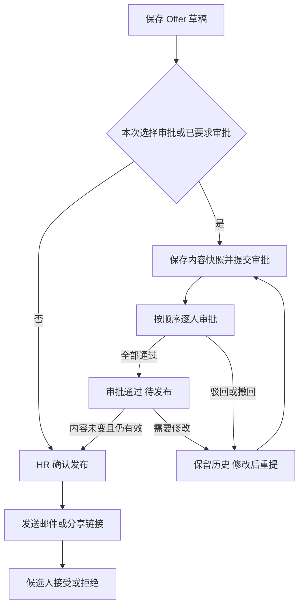

# Offer 系统内审批与飞书通知方案

日期：2026-09-16。状态：完成代码复查的实施方案，尚未开发。

用户已明确的方向：确定 Offer 时可以选择发起审批；流程、展示、审批操作及结果由本系统承载，飞书用于通知。本文其余规则是为闭合流程提出的一期默认设计，不表示用户已经逐项确认，也不表示相关能力已实现。

## 1. 结论与范围

方案可行，未发现阻止该方向实施的架构问题。关键是把审批接入发布前的业务约束，并统一覆盖所有发布入口、草稿变更、招聘流程回退及通知失效。

一期交付一个完整的 Offer 审批闭环：

- HR 保存 Offer 草稿，选择审批人和顺序，提交审批。
- 审批人在系统的独立审批页面逐级通过或驳回；飞书卡片跳转到该页面。
- Offer 页面和审批列表展示当前节点、处理人、意见、时间及最终结果。
- 所有节点通过后，HR 主动确认发布，再发送邮件或分享候选人链接。
- 支持撤回、修改后重提、通知失败处理和完整历史。

一期不建设通用流程设计器，不接入飞书原生审批，不在飞书消息内提供通过/驳回按钮；不做条件分支、会签、或签、加签、代理审批、自动升级和审批通过自动发布。此后若扩展其他业务审批，再依据实际复用点抽取通用能力。

## 2. 当前实现及本次复查发现

复查基线：当前工作区 HEAD `f0461961`。以下为静态代码核查，不代表已做真实账号或生产飞书联调。

| 当前事实                                                                      | 对方案的影响                                                       |
| ----------------------------------------------------------------------------- | ------------------------------------------------------------------ |
| `createOfferDraft` 支持 `sendImmediately`；`sendOfferDraft` 也可发布          | 两个入口必须共用发布校验，不能只改前端按钮                         |
| 发布写入 `publicToken`、`publishedAt` 和 `sent`，节点变为 `awaiting_response` | 审批必须发生在公开发布之前，不能先生成公开链接再等待审批           |
| Offer 的 `version` 只在新建 Offer 时增加，编辑草稿不会增加                    | 必须增加内容修订号，不能用现有 `version` 判断审批内容是否变化      |
| 草稿编辑当前只检查 `draft`；删除接口会物理删除草稿                            | 审批中仍可能被编辑、删除；有审批历史的 Offer 必须保留              |
| 回退到 Offer 或更早节点会将原 Offer 标记为 `superseded`                       | 同一事务需要终止旧审批待办，旧通过结果不能授权新 Offer 发布        |
| 当前通知回退清理主要匹配 AI/真人面试轮次                                      | 新增审批通知必须有独立实例/节点标识，不能假定现有清理自动覆盖      |
| Offer 权限当前只有 `create/read/update/delete`                                | 需要独立的审批处理权限和审批单范围校验                             |
| 飞书投递已支持账号/provider 解析、消息卡片、租约、重试及失败记录              | 可复用通知基础设施，但审批事件、受众、模板和失效规则都需要补齐     |
| 候选人公开页面实时关联候选人姓名、公司名称等信息                              | 审批后的对外展示需要绑定发布快照，避免关联数据变化悄悄改变批准内容 |

现有 `/cancel` 路径实际调用删除草稿，不能将它当成已经具备的“撤回审批”或“撤回已发布 Offer”。现有招聘推进只允许特定面试节点跳过；本方案继续禁止跳过 Offer，不增加新的跳过权限。

本方案对 [2026-09-11 Offer 发布方案](2026-09-11-offer-publication-email-response.md) 中“本期不增加审批层级”的范围作后续扩展。继续保留“发布不自动发邮件、候选人拒绝不自动结束招聘”等边界。旧文档是历史计划，不能以其内容替代当前代码事实。

之前的 [飞书原生审批研究](../research/2026-08-21-feishu-approval-bidirectional-sync-feasibility.md) 是另一条实现路径；其中的审批实例同步、OAuth 订阅和审批定义 API 不属于本方案依赖。

## 3. 一期产品规则

### 3.1 可选审批与发布约束

按用户“可以选择发起审批”的描述，一期采用自愿发起，不引入全工作区强制审批配置。

1. 从未发起过审批的招聘记录，HR 可直接发布，也可提交审批；直接发布保留现有 Offer 权限要求和审计。
2. 一旦首次提交审批成功，为该招聘记录持久化 `offerApprovalRequiredAt`。该记录后续 Offer 发布必须有对应内容的有效通过结果。
3. 撤回、驳回、删除/作废草稿、重新创建 Offer、回退阶段或结束后重新激活，均不清除该约束。一期不提供免审或管理员强制通过入口。
4. 约束属于同一候选人招聘记录，不跨工作区、不自动扩散到该候选人的其他岗位招聘记录。它不能替代公司级强制审批制度；如果目标是制度管控，应另行增加工作区/岗位强制策略。
5. 提交前明确提示：“发起审批后，本次招聘后续 Offer 须审批通过才能发布；撤回或重建 Offer 不会恢复免审发布。”

这使“首次是否发起可选”与“已发起后不能绕过”同时成立，避免只在某个草稿上放布尔开关而被重建绕过。

### 3.2 审批人和顺序

- 提交人从当前工作区具备审批处理权限的有效成员中选择 1～5 人并排序，一人一个节点，依次处理；服务端检查非空、重复、成员身份和权限。
- 不允许发起人审批自己发起的单；一期不支持同一人在多个节点重复审批。
- 提交时固定本次节点、顺序及人员显示快照。审批中不直接替换审批人或编辑流程。
- 节点激活及实际处理时重新校验成员资格和权限。人员失效时展示“审批人不可用，需撤回重提”，不能自动跳过或通过。
- 申请人或有管理权限的人员可撤回，重新选择审批人后新建审批单；新单从第一步开始。已完成审批人的历史意见保留，不能复制成新单的已通过结果。
- 发起人离职时，由具有本记录管理权限的人员接手撤回、重提和后续发布，不能冒用原发起人身份。

### 3.3 通过、驳回、撤回、重新编辑

- “通过”：意见可选；当前节点通过后激活下一个节点，最后一个通过后整体通过。
- “驳回”：理由必填；整单立即结束，未完成节点取消。保留草稿，HR 可修改并重新提交。
- “撤回审批”：理由必填；整单结束，当前及后续待办取消。撤回不删除记录，也不恢复直接发布资格。
- “通过后重新编辑”：先确认“修改后需重新审批”，使本次授权失效，再编辑草稿。审批通过的历史事实不改写为驳回或撤回。
- 重提始终创建新的审批实例并关联上一单，保留所有轮次历史；同一招聘记录最多有一个审批中的 Offer 审批实例。
- 一期使用撤回重提处理错选人员和审批意见录错，不提供覆盖历史决定的接口。

### 3.4 审批通过与发布

审批通过只授予发布资格，不生成候选人链接、不发送 Offer 邮件、不记录候选人接受、不推进背调或入职。

HR 点击“确认并发布”时，服务端在事务内确认：

1. 招聘记录仍有效且处于 Offer 阶段；草稿仍为该记录当前有效 Offer。
2. 操作人具备当前发布所需的权限及候选人数据范围。
3. 若需审批，最新有效授权来自此 Offer、此内容修订、此审批快照，且所有步骤均已通过。
4. 内容未发生变化、授权未失效、有效期未过；预计入职日在过去时要求修正后重新审批。
5. 发布内容固定为已核准的对外快照，并记录 `publishedApprovalId`、发布人和时间。

发布日期与候选人回复截止日不同。审批耗时不会自动顺延候选人截止日期；已过期时必须修改截止日并重审。审批提交要求明确未来的 Offer 截止日，按现有时区和日期转换工具计算，不另造一套日期规则。

## 4. 内容与状态模型

### 4.1 三种版本

| 标识                 | 含义                        | 变化时机                                     |
| -------------------- | --------------------------- | -------------------------------------------- |
| Offer `version`      | 同一招聘记录内的 Offer 版本 | 新建另一份 Offer 时增加，保留现有语义        |
| `contentRevision`    | 当前 Offer 的内容修订号     | 审批相关内容实际变化时递增，无变化保存不递增 |
| 审批 `attemptNumber` | 同一招聘记录的审批轮次      | 每次有效提交新实例时递增                     |

审批绑定 `offerId + contentRevision + snapshotHash`，不接受客户端声明“内容未变”。快照由服务端生成并按固定 schema 版本规范化计算摘要。`snapshotHash` 专门覆盖 Offer 内容和展示身份字段；申请理由及人员流程另存不可变快照，不混入发布时的内容比较。提交请求另有完整请求摘要用于幂等校验。

### 4.2 审批快照

快照包含：候选人姓名及身份引用、招聘记录和岗位引用、发出 Offer 的公司显示名称、职位、币种、Base 月薪、奖金、期权、预计入职日、截止日期、现有 Offer 内部备注、申请理由、审批流程及人员显示名称。薪资沿用现有单位和字段含义，页面明确显示单位，不增加隐式月薪/年薪换算。

- 审批期间锁定 Offer 内容；不冻结整份候选人档案。档案或工作区名称等依赖数据变化后，发布时比较当前应展示内容与快照，不一致则要求重新生成内容修订并重审。
- 已发布 Offer 展示固定的候选人姓名、公司名称和对外条款；后续档案/公司配置变更不改写这份已发布内容。
- `notes` 继续作为内部信息，不能因保存审批快照而暴露到候选人接口。若以后增加对外说明，应使用明确独立字段并纳入审批内容。
- 一期不自动打包完整简历、流水证明、面试报告及谈薪历史。审批详情提供本次 Offer 和申请理由；有额外权限者可另行查看候选人材料。后续若引入审批附件，需固定文件版本和下载授权，不能指向会被覆盖的“最新文件”。
- 审批后修改任一审批内容均失效重审，包括降低薪资或只改日期；一期不做自动判断“有利变更可免审”。

### 4.3 状态分离

| 对象     | 状态/展示                                                                | 规则                                                 |
| -------- | ------------------------------------------------------------------------ | ---------------------------------------------------- |
| 审批实例 | `pending / approved / rejected / withdrawn / cancelled`                  | 待审批、已通过、已驳回、已撤回、业务失效取消         |
| 审批节点 | `waiting / pending / approved / rejected / cancelled`                    | 一个实例最多一个 `pending` 节点；后续为 `waiting`    |
| 审批授权 | `invalidatedAt / invalidationReason`                                     | 独立标记通过结果不再适用于发布，保留历史“已通过”事实 |
| Offer    | 继续使用现有 `draft / sent / accepted / declined / expired / superseded` | 审批中/通过未发布时仍为草稿，不添加重复的审批状态    |
| 通知投递 | 复用现有待发、已发送、失败、结果未知、取消等状态                         | 不影响审批是否已提交或通过                           |

“未发起审批”和“需重新审批”是页面根据约束、当前内容和最新审批推导的状态，不伪造一张审批实例。历史单可显示“已通过 · 已不适用当前 Offer”。

## 5. 页面与使用流程

### 5.1 Offer 卡片与提交弹窗

- 草稿卡片展示 Offer 内容状态和独立审批状态。首次提供“提交审批”“确认并发布”；已要求审批时直接发布按钮受约束并说明原因。
- 审批摘要显示当前轮次、当前审批人、已完成/总节点、提交时间、等待时长及“查看审批”。通过后显示“审批通过，待发布”，不能显示“Offer 已发出”。
- 提交弹窗先展示服务端读取的当前内容，再填写申请理由、选择审批人并排序；标注无飞书绑定的人员和预期通知方式。
- 提交携带所见内容修订及依赖内容摘要；页面过期时服务端返回冲突，要求刷新核对，不能悄悄提交别人刚修改的内容。
- 提交成功以审批单落库为准，提示“审批已提交，通知发送中”。通知失败时保留审批单和明确的处理入口。
- 审批中提供查看、催办、撤回；驳回/撤回后提供编辑和重新提交。通过后提供发布、查看及重新编辑。
- 存在审批历史的 Offer 不再物理删除；未发布的 Offer 可在先终止审批后作废为 `superseded` 并创建新草稿，保留原版本及历史约束。没有审批历史的草稿保留现有删除方式。

### 5.2 独立审批入口

新增“审批”导航及移动端页面，包含“待我审批”“我已处理”“我发起的”；有管理权限者增加“全部 Offer 审批”。

列表展示审批编号、候选人、岗位、提交人、当前节点、状态、提交/处理时间。列表默认不显示薪资详情，所有查询先按权限和关系过滤再分页。

详情页展示审批快照、申请理由、完整节点时间线、审批意见、通知状态和历史轮次。只有当前指定审批人看到可用的“通过/驳回”，其他参与人只读；操作前再次确认，驳回必须填写原因。

审批参与关系只授予该审批单必要信息的访问权，不授予招聘台、完整简历、薪资流水或其他候选人记录的访问权。候选人详情链接按原有权限独立判断。

### 5.3 状态更新与飞书跳转

- 结果统一读取系统数据库，无飞书审批结果同步链路。
- 一期用请求成功后刷新缓存、窗口重新聚焦刷新、可见页面每 15 秒轮询待审批数据实现更新；隐藏页面停止定时刷新，终态详情停止轮询。
- 展示最近刷新时间；请求失败提示状态可能过期，不把旧结果当作操作成功。提交决定必须通过后端重新校验，不依赖轮询及时性。
- 飞书跳转到包含工作区 slug 和审批实例 ID 的系统地址；未登录先登录并安全返回原审批页，不能跳回首页丢失上下文。
- 在错误工作区登录、不是成员、权限撤销或链接被转发时不返回审批内容。仅访问链接、GET 请求和飞书链接预览绝不能触发审批决定。

## 6. 权限设计

新增 `offerApproval` 权限资源及审批页面权限，接入现有有效权限快照和工作区权限管理界面，不能只修改静态默认角色。

| 操作          | 要求                                                                                 |
| ------------- | ------------------------------------------------------------------------------------ |
| 发起审批      | `offerApproval.create`、现有 Offer 编辑权限、该候选人记录可见范围；有效工作区成员    |
| 读取审批      | `offerApproval.read`，且为发起人/本单指定审批人，或有 `manage` 及该记录管理范围      |
| 审批决定      | `offerApproval.decide`、本单当前节点指定人、有效成员，且不是发起人；已有详情读取权限 |
| 撤回审批      | 发起人仍具 `create` 及该记录权限，或 `manage` 加该记录管理范围；理由必填             |
| 催办/通知重发 | 同撤回的关系范围，另校验当前节点及服务端频率限制                                     |
| 发布 Offer    | 现有 Offer 发布权限、记录范围及审批发布约束全部成立                                  |

默认 HR 获得发起、读取和审批页面权限；审批处理权限由工作区管理员显式授予需要审批的成员。owner/admin 可获得管理和处理能力，但处理决定仍须被指定为当前审批人，不可因管理员身份越过流程。无招聘台权限的成员可单独被授权进入审批页。

成员离开或被设为无访问权限后立即失去读写能力；历史姓名和意见保留。已经合法作出的通过决定不因审批人后来离职而被改写，尚未处理节点则不能继续由其处理。

平台管理员支持权限不得通过正常业务接口隐式变成审批人。发布、发起和审批 API 都必须校验工作区、对象所属关系和操作权限；不接受客户端传入其他工作区 ID 来替换 URL 上下文。

## 7. 飞书通知与可靠性

### 7.1 通知事件

| 时机                 | 接收人                                                   | 内容/动作                                              |
| -------------------- | -------------------------------------------------------- | ------------------------------------------------------ |
| 首节点或下一节点激活 | 当前节点审批人                                           | 有一项 Offer 待审批；进入系统审批                      |
| 整体通过或驳回       | 发起人；发起人不可用时显示给本记录管理人员的系统异常列表 | 审批结果；进入系统查看，通过后提醒 HR 发布             |
| 撤回或业务失效取消   | 已激活节点的审批人，必要时发起人                         | 此前审批任务已结束，不再处理                           |
| 手动催办             | 当前节点审批人                                           | 待办提醒；同一节点最多每 30 分钟一次，由服务端执行限制 |

按系统用户去重，避免同一人一次事件收到多条。未激活节点不提前发送“待你审批”。一期不自动定时催办、不发群通知、不通知候选人。

卡片仅包含工作区、审批编号、候选人必要标识、岗位、发起人、通知时点状态及系统链接，不包含金额、证明材料、完整审批意见或公开 Offer Token。卡片说明“当前状态以系统页面为准”；一期不承诺历史卡片实时更新。

### 7.2 身份与可达性

- 复用飞书账号绑定与 provider 选择逻辑；发送目标必须属于匹配的飞书应用身份，不能仅凭邮箱猜测接收人。
- 发起前展示绑定情况；缺少绑定不妨碍创建系统待办，但明确提示该人员无法接收飞书通知。一期不自动转邮件或给无关 HR 发消息。
- 系统能预检本地绑定和应用配置，不能仅凭本地数据保证飞书可达。机器人可用范围、应用授权、失效账号等以真实投递结果和联调为准。[飞书发送消息文档](https://open.feishu.cn/document/server-docs/im-v1/message/create)、[官方 SDK 的接收人限制](https://pkg.go.dev/github.com/larksuite/oapi-sdk-go/v3/service/im/v1)。
- 后续补绑或配置修复后，可对仍有效的待办重新投递；保留旧失败记录，重新解析并记录新的投递身份。
- 无可用发起人时不任意广播敏感结果；工作区审批管理视图提供未处理异常和可接手入口。

### 7.3 保存与投递顺序

审批状态、节点、活动记录和待发送通知事件在同一数据库事务写入。通知发送发生在事务提交之后，由现有 Worker 处理；队列唤醒失败由数据库扫描恢复，不因飞书请求失败回滚审批决定。

新增通知类型、`offer_approval` scope、审批实例/节点关联、专用接收人类型和模板；扩展 schema、数据库约束、调度、投递白名单、内容生成及失效逻辑。不能把审批人伪装成面试官或直接套用当前 HR fallback 策略。

事件以“审批实例 + 节点 + 事件类型 + 业务动作身份”去重，单接收人投递另设去重键。重试沿用同一次发送身份；手动再次通知是新动作并受限频保护。供应商结果未知时标记待核查，禁止无条件立即重试或宣称已送达。系统待办具有确定性去重，外部消息仅保证尽量去重，不宣称端到端恰好一次。

审批终止时，同事务取消过期的待办提醒及催办事件/投递，覆盖普通和隔离队列状态。结果通知与待处理通知按类型分别判断，不能一律取消。Worker 发送前再查审批、节点、成员和通知适用性；已过期消息不发送。

外部发送与撤回可能恰好交错，已经发出的卡片无法保证撤回。用卡片状态说明、取消通知和服务端操作校验收口；旧链接始终进入当前只读结果，不能处理已结束的任务。

## 8. 服务端、持久化与一致性

### 8.1 建议数据结构

下列为新增设计，现有数据库尚无这些审批表和字段。命名保持 `recruiting_*`，不写回归档的 legacy 表。

| 对象                          | 主要字段和约束                                                                                                                                                     |
| ----------------------------- | ------------------------------------------------------------------------------------------------------------------------------------------------------------------ |
| `recruitingRecord` 扩展       | `offerApprovalRequiredAt`，首次发起后保持；不依赖某个可删除的草稿推导                                                                                              |
| `recruitingOffer` 扩展        | `contentRevision`、`currentApprovalId`、`publishedApprovalId`、`publishedSnapshot`；保留原 `version/status` 语义                                                   |
| `recruitingOfferApproval`     | 工作区/招聘记录/Offer ID、轮次、内容修订、snapshot/schemaVersion/hash、流程快照、提交人、状态、当前节点、提交/结束时间、失效时间/原因、上一实例、提交/撤回幂等身份 |
| `recruitingOfferApprovalStep` | 实例 ID、顺序、审批人及显示快照、状态、激活/处理时间、意见、决定幂等身份；实例内顺序唯一                                                                           |
| 现有通知事件/投递扩展         | 审批实例和节点关联、事件类型、受众及模板；仍复用原事件/投递表                                                                                                      |
| 现有 `recruitingEvent`        | 审批提交、步骤通过/驳回、整体通过、撤回、授权失效、草稿作废、催办；关联审批 ID/轮次/修订/操作人，不记录敏感快照全文                                                |

审批和节点用复合外键或等价约束保证工作区、招聘记录及 Offer 一致；数据库增加“每个招聘记录最多一个 `pending` 实例”和“每个实例最多一个 `pending` 节点”的部分唯一约束。历史实例和步骤不硬删除，引用用户的显示快照能在用户失效后继续解释历史。

普通草稿删除不得级联删除审批历史。有审批历史的招聘记录需扩展现有引用保留策略，拒绝普通硬删除并提示使用“结束招聘”；不能新增无审计的清空审批入口。工作区整体删除继续按项目既有管理边界处理。

### 8.2 事务与并发

统一锁顺序：招聘记录 → 当前 Offer → 审批实例 → 当前步骤。所有发起、通过、驳回、撤回、草稿变更、发布及招聘回退/结束路径遵守同一顺序，不在数据库事务中调用飞书。

- 提交审批与编辑并发：根据内容修订和服务端快照校验，只有一方能基于所见版本成功；不会审批未见内容。
- 通过与驳回并发：首次有效提交生效，另一请求返回当前结果和冲突，不覆盖决定。
- 撤回与通过并发：先拿到锁并提交的一方生效。最后一步已通过时撤回请求返回已通过；若需要修改，走明确的授权失效操作。
- 节点激活时人员已失效：节点仍记为当前 `pending`，但处理能力被冻结，显示不可用原因并进入管理异常列表；不丢失当前节点，也不向后跳过。撤回重提完成恢复。
- 发布与重新编辑并发：发布前再次校验修订和授权，不能发布发生变化的内容。已经发布后禁止原地编辑。
- 招聘回退/结束：待审批单变 `cancelled`，待办和提醒失效；通过但未发布的授权标记失效。已发布的审批证明保留历史，不能因后续结束把合法发布记录改成未审批。
- 同一招聘记录重新激活、即使内容完全相同，也不得重新使用已失效的审批授权。

客户端为提交、节点决定和撤回生成 `requestId`，服务端在对应实例/节点持久化其作用域、请求摘要和结果身份，并设置唯一约束。相同 key/相同请求返回原结果，不新增实例、决定或事件；相同 key/不同请求返回冲突。并发等待后须重查回执；重试仍需身份和数据访问校验。

重复发布沿用已有发布身份和链接，不生成第二份 Token；若现有接口尚不满足，则纳入本次发布应用动作的验收。客户端超时先查询原审批单/动作结果，不以刷新为由自动创建新申请。

### 8.3 代码边界与接口

Offer 审批作为 `studio` 下独立业务能力，建议放在 `apps/server/src/server/routes/studio/routes/offer-approvals/`，由 `route.ts` 挂载；详情和待办无需先经过招聘台读取权限。

业务动作使用 route-owned `application/`，包含提交、决定、撤回、授权失效、查询和通知准备；DAO 负责事务内持久化，通知通过既有能力端口接入。现有 Offer 两条发布路径共用同一发布应用动作，禁止各自复制一套审批判断。

招聘回退/结束发生在 `@app/database` 中，不得反向导入 Server 路由。将审批失效需要的事务内持久化原语放在既有数据库层，由招聘生命周期事务和审批应用动作共同调用；飞书投递仍留在 Worker。

接口建议（均在 `/api/w/:slug/studio` 下）：

| 方法与路径                                                 | 行为                                                                                                     |
| ---------------------------------------------------------- | -------------------------------------------------------------------------------------------------------- |
| `GET /offer-approvals/approvers`                           | 返回本工作区可选审批人及本地飞书绑定提示，只给有发起权限者使用                                           |
| `POST /offer-approvals`                                    | 输入 recruitingRecordId、offerId、expectedContentRevision、所见内容摘要、审批人顺序、申请理由、requestId |
| `GET /offer-approvals?view=...`                            | 按待我审批/我已处理/我发起/管理范围读取，分页、筛选和计数统一鉴权                                        |
| `GET /offer-approvals/:approvalId`                         | 返回授权范围内的快照、流程和当前状态                                                                     |
| `POST /offer-approvals/:approvalId/steps/:stepId/decision` | 通过或驳回；校验当前步骤及请求身份                                                                       |
| `POST /offer-approvals/:approvalId/withdraw`               | 有理由的撤回                                                                                             |
| `POST /offer-approvals/:approvalId/remind`                 | 对当前待办催办，限频且去重                                                                               |
| `POST /offer-approvals/:approvalId/retry-notification`     | 对适用的失败通知重新投递；未知结果须先核查                                                               |
| 现有 Offer 编辑、发布、创建即发布、删除/取消接口           | 接入内容修订、授权失效、发布门禁和历史保留；不新增可绕过检查的替代路径                                   |

授权失效与编辑必须是显式确认的业务动作：可在现有 PATCH 中加入“确认失效并编辑”语义和所见修订，不能让一次普通保存静默撤销批准。有审批历史的草稿增加独立的作废动作，保留原 `/cancel` 对无历史草稿的兼容语义。

纯 DTO/校验契约放 `@app/shared`，schema 和 relations 放 `@app/db-schema`，按现有迁移工具生成迁移。Worker 只通过 Server 已声明的 exports 调用能力，不导入路由私有路径；沿用现有 Effect 编排，不新建第二套调度框架。

前端路由只放声明、loader 和薄组合，功能放 `components/features/offer-approval/`。页面权限、导航、授权 DTO、Hono RPC 和缓存失效同步接入；实现新路由前读取仓库 TanStack Intent 指引。

## 9. 历史数据、发布与回退

1. 历史已发布 Offer 不补造审批，不因上线自动撤回；标记为历史未走系统审批。历史草稿初始化内容修订，首次审批前继续保留原可选行为。
2. 新发布均保存对外快照；历史公开 Offer 暂保留原兼容读取路径，不伪造当时不存在的历史快照。已审批的新发布禁止回退到动态关联字段读取。
3. 先上线兼容 schema、服务端门禁和理解新通知的 Worker，再开放 UI 提交入口。旧客户端的创建即发布同样必须被服务端拦截；不能以兼容旧客户端为由允许绕过。
4. 验证权限模板、动态权限设置、新通知模板、provider 绑定、隔离队列和服务端/Worker 版本一致后再开放真实使用。
5. 上线后需暂停时关闭新申请入口，但继续允许已有单查看、处理和撤回；已经建立的发布约束始终生效。不能直接回退到不识别审批字段的旧服务端；紧急回退必须保留门禁补丁，必要时暂停受影响 Offer 发布。
6. 上线后以新版本实例起点检查队列积压、不可用审批人、失败/未知投递及发布冲突。不能用历史消息成功记录代替新审批通知验收。

## 10. 验收清单

| 场景                                    | 必须满足的结果                                           |
| --------------------------------------- | -------------------------------------------------------- |
| 从未审批，直接发布                      | 保留原流程；记录未走审批发布，不伪造“审批通过”           |
| 一人/多人顺序审批                       | 当前人可处理，未来节点不可抢先；最终通过后才可发布       |
| 提交后重复点击、超时重试                | 只产生一张审批单、一套步骤和一次有效通知事件             |
| 双人编辑、旧页面提交                    | 内容修订冲突可解释，批准内容与所见内容一致               |
| 审批中尝试改薪、删除、直接调用发布      | 服务端阻断，包含 `sendImmediately` 入口                  |
| 驳回/撤回后删草稿重建                   | 历史保留，仍须审批，不能恢复免审                         |
| 通过后改日期、金额、公司/候选人显示信息 | 发布校验失败或明确失效重审，不继承旧授权                 |
| 通过后发布且全局名称随后变化            | 候选人看到固定的已批准发布快照                           |
| 审批通过时 Offer 截止日已过             | 不能发布，修正日期后重审                                 |
| 通过/驳回/撤回/回退相互并发             | 一个合法结果；没有双当前节点、重复通过或失效授权发布     |
| 招聘结束、回退、重新激活                | 待办和旧提醒失效；历史意见可查，新 Offer 不复用旧授权    |
| 审批人没有招聘台权限                    | 能看到本单并处理，不能越权读取简历、流水和其他单         |
| 跨工作区、转发链接、自审、管理员代点    | 所有越权请求拒绝；列表数量和搜索同样不泄漏               |
| 人员离职、角色变化、发起人不可用        | 未处理节点不跳过；有权限人员能撤回重提，历史合法决定保留 |
| 飞书未绑定/机器人不可达/发送失败        | 系统审批单存在且可处理，显示失败/缺失渠道，可修复后重发  |
| 飞书超时未知、Worker 重启和重复调度     | 业务状态不回滚，无盲目立即重发；去重/恢复可验证          |
| 撤回与通知发送交错                      | 尽量抑制旧提醒；即使收到旧卡片也无法审批旧任务           |
| 手机打开、登录跳转、焦点刷新            | 回到原审批单，状态和按钮正确，重复提交被保护             |
| 候选人接受/拒绝、HR 代录、邮件/分享     | 保留现有行为；审批意见和内部备注不出现在公开接口         |
| 服务端回退/旧客户端                     | 已要求审批的记录仍无法绕过门禁                           |

实现时覆盖应用动作和路由行为测试；数据库集成测试验证唯一约束、锁顺序、并发和事务回滚；Worker 测试验证去重、重试、取消与隔离队列。按受影响包运行测试、类型检查和改动文件 lint/format，涉及 RPC 同时检查 Web 消费方。

真实联调至少使用 HR、审批人 A、审批人 B 和无权限成员四类身份，覆盖顺序通过、驳回重提、撤回、手机飞书跳转及通知失败。未完成真实飞书联调不得标记“通知闭环已验收”。

## 11. 按可交付行为拆分

1. **HR 可提交、单人可审批、通过后可发布**：快照/修订、权限、独立详情、单节点和两条发布入口的门禁形成可测试闭环。
2. **多人按顺序处理并在系统追踪**：节点流转、待我审批/我发起/我已处理、状态刷新和移动端操作。
3. **驳回、撤回及修改后重提可闭环**：历史轮次、草稿作废、持久发布约束、招聘回退/结束和并发保护。
4. **飞书通知可送达并可处理异常**：事务事件、卡片深链、身份匹配、失败重发、催办及失效提醒抑制。
5. **生产启用可验证**：历史兼容、权限与通知配置、四类身份端到端验收、监控和保留门禁的暂停方案。

这些是实施切片，不是允许先把缺少门禁、历史保留或失败恢复的版本开放给真实用户；完整一期验收后再正式启用。

## 12. 代码与设计参考

- [Offer 路由](../../apps/server/src/server/routes/studio/routes/interviews/routes/offer-drafts/route.ts)
- [Offer 草稿、编辑、发布及删除](../../apps/server/src/server/routes/studio/routes/interviews/dao/offer-drafts.ts)
- [Offer 邮件与链接](../../apps/server/src/server/routes/studio/routes/interviews/dao/offer-delivery.ts)
- [候选人公开 Offer](../../apps/server/src/server/routes/public/routes/offers/route.ts)
- [Offer 前端卡片](../../apps/web/src/components/features/studio/offer-stage-cards.tsx)
- [招聘生命周期](../../packages/database/src/recruiting-pipeline.ts)及[推进证据检查](../../packages/database/src/recruiting-pipeline-evidence.ts)
- [引用保留策略](../../packages/database/src/recruiting-reference-retention.ts)及[通知失效](../../packages/database/src/recruiting-notification-invalidation.ts)
- [工作区权限](../../packages/shared/src/permissions.ts)及[请求授权策略](../../apps/server/src/server/access/workspace-access-policy.ts)
- [Schema](../../packages/db-schema/src/schema.ts)及[通知契约](../../packages/db-schema/src/interview-notifications.ts)
- [通知事件](../../apps/server/src/server/interview-notifications/utils/events.ts)、[接收人解析](../../apps/server/src/server/interview-notifications/utils/prepare-deliveries.ts)、[Worker 投递](../../apps/worker/src/interview-notifications/processor.ts)
- [Server 架构](../agents/server-architecture.md)、[运行时边界](../agents/runtime-boundaries.md)、[TanStack Intent](../agents/tanstack-intent.md)
- [工作区边界 ADR](../adr/0001-use-workspaces-for-recruiting-tenancy.md)、[招聘数据所有权 ADR](../adr/0036-copy-recruiting-data-into-independent-tables.md)、[Worker 编排 ADR](../adr/0035-use-effect-for-worker-orchestration.md)
