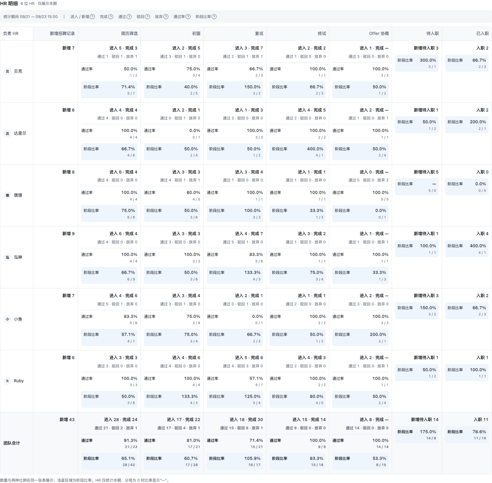

# 招聘台账 · HR 统计方案

- 日期：2026-09-23
- 状态：已按本次讨论的最终口径整理保存，尚未实施
- 用途：HR 绩效与招聘转化评价；周度跟踪过程，完整月度辅助绩效复盘。
- 范围：新增统计视图，沿用现有招聘流程和权限，不修改业务推进规则。
- 后续收敛版本：[HR 统计简单版方案](2026-09-23-hr-statistics-simple.md)，仅保留进入阶段次数与阶段比率；本文件作为完整版本背景保留。

## 1. 已确认的产品方向

1. 在招聘台账中增加「HR 统计」，与「候选人明细」「按岗位汇总」并列。
2. 默认本周，支持本周、上周、本月、上月及自定义时间范围。
3. 展示阶段为：新增招聘记录、简历筛选、初面、复试、终试、Offer 协商、待入职、已入职。
4. Offer 协商合并展示流水提供、谈薪、发 Offer、背调；保留子阶段明细。
5. 除工作次数外，展示通过数量、驳回数量及期间通过率。
6. 期间通过率为：期间通过数 ÷（期间通过数＋期间驳回数）。
7. 用于绩效与转化评价，必须同时呈现候选人放弃、待确认及最终入职成果，避免仅用通过率排名。
8. 增加「阶段比率」：本期本阶段数量 ÷ 本期上一阶段数量，与期间通过率并列展示。
9. 团队汇总保留数量与比例的上期比较；通过率、阶段比率分别展示本期、上期和百分点变化。
10. HR 明细将数量、通过率和阶段比率放在同一张表中，各阶段横向并列，仅展示本期，不提供阶段筛选、指标切换或上期比较。
11. 每项指标提供问号说明；自定义选择完整自然周或自然月时，分别对比前一个自然周或自然月，其余范围采用前一等长区间。

以下内容为实施默认口径。其中历史数据覆盖和负责人归属须在实施前核验，不能视为已具备。

## 2. 页面与交互

### 2.1 入口与筛选

- 入口：招聘台账 → HR 统计。
- 时间：本周（默认）｜上周｜本月｜上月｜自定义，始终显示具体起止日期。
- 业务筛选：部门、岗位、负责 HR，支持组合筛选。
- HR 统计拥有独立时间语义，不直接继承候选人明细的「创建时间」「入职日期」过滤条件。
- 查看范围沿用现有招聘数据权限。只能看到部分数据时使用「可见范围合计」，不得暗示全团队。
- 切换到其他台账视图不改变对方指标口径；返回统计时保留已选条件。

### 2.2 三个统计区域

**A. 期间工作量与通过率**

- 上方提供团队阶段汇总，下方按 HR 展示相同口径。
- 阶段列组：进入记录数、处理／完成次数、通过数、驳回数、放弃数、通过率、阶段比率。
- 不适用的指标不展示；不通过填 0 来伪装适用。
- HR 使用一张合并表：各阶段固定横向并列、HR 固定为行；取消阶段筛选及「数量与成果／通过率对比／阶段比率对比」指标切换。
- 每个 HR × 阶段单元格仅展示本期：进入／新增及完成次数；通过、驳回、放弃数量；通过率；阶段比率。数量与两种比例同时可见，不显示 HR 的上期值或变化。
- 新增记录仅展示本期数量；待入职、已入职展示本期对应数量和阶段比率，不虚构不适用的通过率。
- 保留样本量及指标说明；表格上方共用指标说明栏放置各项指标的问号，单元格不重复堆叠问号。宽度不足时固定 HR 列并横向滚动，不改回阶段或指标筛选。
- 团队汇总的「通过率」「阶段比率」各自形成“本期／上期／变化（百分点）”列组，两种比例的比较区间保持一致。

**B. Offer 与入职转化**

- 独立展示 Offer 接受率、到岗率及各自的样本数量。
- 清楚说明日期选择在这里分别代表「Offer 首次有效发出日期」「约定到岗日期」。
- 不将本期独立发生的面试、Offer、入职数量相除作为完整漏斗转化率。

**C. 当前积压**

- 展示当前待确认、Offer 协商中、待回复、待入职数量，以及等待时长。
- 明确标注「截至现在，不受日期筛选影响」，仍受部门、岗位、HR 与权限筛选约束。
- 如后续增加「截至所选期末」历史积压，必须有历史重建能力后再开放。

### 2.3 明细核对

- 所有数量可点击查看对应招聘记录或事件明细；次数明细按事件展示，通过人数明细按记录展示。
- 比例可查看分子、分母及两侧明细，避免只能看到百分比。
- 明细带统计事件时间、归属 HR、岗位、阶段、结果及数据完整性提示。
- 不能直接跳转到仅按当前阶段筛选的候选人列表替代历史统计明细。
- 团队合计、HR 行与明细数量必须可以相互核对。

### 2.4 指标问号说明

- 每个指标标题旁增加问号图标，覆盖团队汇总、HR 共用指标说明栏、转化指标、当前积压及团队上期比较；一般表格在指标列标题提供说明，HR 合并表集中在表格上方提供，不在每个数值单元格重复放置。
- 鼠标 hover 显示说明，键盘聚焦也可显示；触屏支持点击打开，支持关闭，不依赖 hover 才能理解口径。
- 说明至少包含：指标含义、计数单位、使用的时间字段、去重方式、包含／排除范围；比例另列分子和分母。
- 比较指标的说明显示本期与对比期的具体起止时间、计算公式、未结束／数据不足等情况。
- 当前积压的说明明确「截至现在，不随日期范围变化」。
- 问号说明、明细查询和实际聚合共用同一套指标定义，避免界面解释与实现不一致。
- 示例——「复试通过率」：按所选期间正式确认的复试结论统计；通过率＝通过招聘记录数÷（通过＋驳回招聘记录数）。按招聘记录与阶段去重；不包含未决、放弃及跳过。上周面试、本周确认的结果计入本周；无有效决策时显示“—”。

## 3. 日期与上期比较

### 3.1 时间边界

- 时区统一为 Asia/Shanghai；自然周为周一至周日，自然月按日历月。
- 日期区间对用户含首尾两天；查询采用起始日 00:00 至结束日下一天 00:00 的左闭右开区间。
- 本周、本月及结束日期为今天的自定义区间均统计至当前刷新时刻，显示「本期未结束」。
- 本期、对比期使用同一次计算的截止时刻，避免刷新跨日导致两侧边界不一致。
- 不开放未来日期作为期间成果区间；待入职未来安排属于当前积压与计划信息。

### 3.2 对比区间规则

| 时间选择                         | 对比区间                                                                   | 界面称呼             |
| -------------------------------- | -------------------------------------------------------------------------- | -------------------- |
| 本周，尚未结束                   | 上周一至上周相同星期、相同时刻                                             | 较上周同期           |
| 上周，完整自然周                 | 再前一个完整自然周                                                         | 较前一周             |
| 本月，尚未结束                   | 上月 1 日至上月相同日、相同时刻                                            | 较上月同期           |
| 上月，完整自然月                 | 再前一个完整自然月                                                         | 较前一月             |
| 自定义，恰好一个完整自然月       | 前一个完整自然月；若今天是所选月最后一天且尚未结束，则按自然月同期规则截断 | 较前一月／较上月同期 |
| 自定义，恰好一个完整自然周       | 前一个完整自然周；若今天是所选周日且尚未结束，则截止到上周日相同时刻       | 较前一周／较上周同期 |
| 其他自定义范围，结束日期早于今天 | 开始日期之前紧邻的同天数区间                                               | 较前一等长区间       |
| 其他自定义范围，结束日期为今天   | 前一同天数区间，截止到对应日期的相同时刻                                   | 较前一等长区间同期   |

- 自定义先识别是否恰好覆盖一个自然月或自然周，再对其他范围按含首尾的自然日数 N 计算。等长比较时，设开始日为 S，实际统计截止时刻为 E，则对比区间为 [S－N 天，E－N 天)。两侧均采用左闭右开边界。
- 示例：自定义 2026-08-01 至 2026-08-31，对比 2026-07-01 至 2026-07-31；自定义 2026-04-01 至 2026-04-30，对比 2026-03-01 至 2026-03-31，而不是 3 月 2 日至 31 日。
- 示例：自定义 2026-09-10 至 2026-09-16，共 7 天；对比 2026-09-03 至 2026-09-09，共 7 天。
- 示例：自定义 2026-09-20 至 2026-09-23，若当前为 23 日 15:00，则本期为 20 日 00:00 至 23 日 15:00；对比 16 日 00:00 至 19 日 15:00。
- 示例：本周在周三 15:00 查询，本期为本周一 00:00 至周三 15:00；对比上周一 00:00 至上周三 15:00，不对比上周整周。
- 月份长短不同时，上月截止时间最多取月末下一天 00:00，不越界。若无法达到相同进度，显示「上月已结束，区间天数不同」，不再标作等进度比较。
- 完整自然月允许 28／29／30／31 天差异，仍比较完整月总量并展示双方天数，不自动换算日均。
- 同一个完整自然月或自然周，无论通过快捷按钮还是自定义选择，对比区间必须一致。按日期边界识别自然周期，不以“30 天”或“31 天”猜测整月；跨月但不对齐月初月末的区间仍按等长天数比较。
- 页面在筛选区固定显示「本期：…；对比期：…」，问号补充精确时间及公式，不只显示含糊的“上周期”。
- 自定义区间不按工作日、节假日或星期结构自动校正，不宣称等长区间具有相同招聘机会。

### 3.3 比较数值与可比性

- 两侧使用完全相同的指标定义、部门／岗位／HR 筛选、权限及去重规则，独立查询；仅替换日期边界。
- 数量差为本期－对比期；数量增长率为（本期－对比期）÷对比期。示例：12 对 10，显示「+2，+20%」。
- 对比期为 0 时显示「上期为 0，无法计算增长率」，仍展示数量差；两期均为 0 时数量差为 0，增长率为“—”。
- 通过率各自按当期通过÷（通过＋驳回）计算，再相减得到百分点变化。示例：本期 8/10＝80%，上期 6/10＝60%，显示「+20 个百分点」。
- 任一侧通过率分母为 0 时，比例变化显示“—”，同时保留两侧样本量。
- 对比区间早于可靠数据起点、历史归属缺失或关键事件覆盖不足时，显示「对比数据不足」并停算该指标变化，不能当作 0。
- 上期比较仅用于团队汇总，覆盖期间工作量、阶段成果、期间通过率和阶段比率；HR 表（含其合计行）仅展示本期数量和比例。阶段比率必须在两段区间各自按“本阶段数／上一阶段数”计算，再相减得到百分点变化，不与通过率比较列混用。当前积压没有期末历史快照时不提供上期变化。
- Offer 接受率、到岗率是批次指标，历史样本有更长观察时间。第一版只展示批次结果、样本成熟情况和观察截止时间，不提供自动上期增减；后续须统一随访时长后再比较。
- 上期比较属于辅助观察，不自动转成绩效评分或红绿优劣结论。

## 4. 阶段与成果定义

| 统计行       | 工作量定义                                       | 通过／成功定义                               | 时间依据                           |
| ------------ | ------------------------------------------------ | -------------------------------------------- | ---------------------------------- |
| 新增招聘记录 | 新增招聘记录数，不等同于简历文件上传次数         | 不适用                                       | 招聘记录创建时间                   |
| 简历筛选     | 正式完成的筛选决策次数                           | HR 正式确认筛选通过                          | 决策确认时间                       |
| 初面         | 实际完成的初面轮次，区分 AI／人工来源            | 初面节点正式通过；生成报告不等于通过         | 工作量按完成时间，结果按决策时间   |
| 复试         | 实际完成的复试轮次                               | 复试节点正式通过                             | 工作量按完成时间，结果按决策时间   |
| 终试         | 实际完成的终试轮次                               | 终试节点正式通过                             | 工作量按完成时间，结果按决策时间   |
| Offer 协商   | 本期进入协商的招聘记录数；子阶段处理次数展开查看 | 所有必需步骤完成并满足进入待入职条件         | 进入时间、整体结果确认时间分别统计 |
| 待入职       | 本期新进入待入职的招聘记录数                     | 不单设通过率；当前待入职放在积压区           | 进入待入职时间                     |
| 已入职       | 本期实际入职招聘记录数                           | 最终招聘成果，不再设置一个恒为 100% 的通过率 | 已确认实际入职日期                 |

- Offer 协商的整体通过只计一次，不累加流水、谈薪、Offer、背调的通过数。
- Offer 已接受但必需背调尚未完成，不计作整体协商通过。
- 协商期间企业正式终止为驳回；候选人主动拒绝／退出为放弃。内部 Offer 审批退回不是候选人阶段驳回。
- “驳回”在统计界面对应系统的正式淘汰结果；“待确认”“待补充”不算驳回。
- 初面需要覆盖现有人工初面路径；录音上传、材料生成与正式初面完成不能混为一个事实。
- 跳过阶段不计作实际处理、通过或驳回；可单列跳过数量用于解释流程差异。
- 取消、改期、重复保存、报告重试不增加实际完成次数。

## 5. 四类比例

### 5.1 期间通过率：衡量本期正式决策结果

公式：本期有效通过记录数 ÷（本期有效通过记录数＋本期有效驳回记录数）。

- 分子与分母都按正式结果确认时间归期，属于同一阶段和筛选范围。
- 排除未决、候选人放弃、跳过；放弃数单列，不能隐藏。
- 上周面试、本周出结论：完成次数归上周，通过／驳回数量归本周。
- 因此本期通过数可以大于本期面试完成次数，两者不能强行勾稽为同一分母。
- 团队通过率按总分子除以总分母，不取 HR 个人比例的算术平均。
- 显示百分比及样本，例如「80.00%（8 / 10）」；分母为 0 显示「—」。

### 5.2 阶段比率：衡量本期相邻阶段的数量关系

公式：本期本阶段数量 ÷ 本期上一阶段数量。

- 使用汇总表「进入／新增」列的招聘记录数，不使用可重复的面试轮次数，也不使用阶段通过数作为分母。
- 阶段顺序固定为：新增招聘记录 → 简历筛选 → 初面 → 复试 → 终试 → Offer 协商 → 待入职 → 已入职；隐藏行、表格排序或筛选不改变上一阶段的定义。
- 新增招聘记录为基准行，阶段比率显示“—”；首行不人为设置 100%。
- 简历筛选至 Offer 协商按本期首次进入该阶段的记录数；待入职按本期新增待入职记录数；已入职按本期实际入职记录数。均按招聘记录＋阶段去重。
- 例如本期初面进入 17 条、复试进入 18 条，复试阶段比率为 18/17＝105.9%；本期复试通过 15 条、驳回 6 条，通过率为 15/(15＋6)＝71.4%。两者独立展示。
- 页面显示比率和计算样本，如「105.9%（18 / 17）」，问号说明明确前后阶段名称及取数规则。
- 团队汇总增加上期阶段比率及百分点变化：本期 18/17＝105.9%，假设上期 16/20＝80.0%，则变化为 +25.9 个百分点。计算时使用未四舍五入的原值，展示时统一保留一位小数。HR 表不展示这项跨期比较。
- 任一周期的上一阶段数为 0 时，该周期比率及跨期变化显示“—”；任一周期的数据不足则显示“数据不足”，不当作 0。
- 两侧使用相同时间范围、业务筛选和权限；HR 行使用同一 HR 的事件归属统计，团队比率按团队总分子／总分母计算，不平均个人比率。
- 上一阶段数量为 0 显示“—”，同时保留分子／分母；上期积累、阶段跳过或 HR 交接都可能导致比率超过 100%，不得截断。
- 这是期间数量比，不是同一批候选人的转化概率；不能把 105.9% 解读为超过 100% 的招聘成功率，也不据此自动评价优劣。
- 「已入职／待入职」的阶段比率与按约定到岗批次计算的到岗率不同，两者保留独立名称与说明。
- 明细查看需分别展示本阶段分子与上一阶段分母，不能只展示前后阶段交集或仅分子。

### 5.3 Offer 接受率：衡量同一批有效 Offer 的候选人选择

- 批次：所选期间首次有效发出的 Offer，按招聘记录去重；撤销的错误发送与被替代版本不得重复进入样本。
- 观察截止：页面显示的统计刷新时间；历史批次后续收到回复，其接受率可以继续变化。
- 公式：批次接受数 ÷（批次接受数＋批次拒绝数）。
- 同时展示待回复、过期未回复、企业撤回数量；这些不伪装成候选人拒绝。
- 版本替换跟踪同一招聘记录的有效 Offer 结果，不把多次改薪重复计入。
- 这是已明确答复者的接受率，不等于所有发出 Offer 的最终成功率；必须显示答复覆盖情况。

### 5.4 到岗率：衡量约定到岗人群的履约结果

- 批次：约定到岗日期在所选期间、且已进入待入职的招聘记录。
- 分母：截至观察时刻已到约定日期的应到岗记录；分子：其中已确认实际入职的记录。
- 尚未到约定日期者单列「未到期」，不进入当前分母。
- 已到期但未确认者保留在分母并单列「待确认」，防止延迟更新虚增到岗率。
- 明确放弃及未到岗仍保留在应到岗批次；分母不能只保留成功者。
- 到岗日期改期需要历史记录：实际提前批准的改期按新计划归期；不能用事后改期消除原来的未到岗事实。
- 「本期实际入职数」与「本期应到岗批次的已入职数」是不同指标，不要求数值一致。

## 6. 计数、归属与绩效公平性

### 6.1 计数单位及重复流程

- 成果单位为招聘记录；同一自然人应聘不同岗位可产生多条记录，界面说明不称全局去重人数。
- 工作次数按真实完成事件计数，通过／驳回按招聘记录＋阶段的有效结论计数。
- 重面可以增加真实工作次数；回退重开后的重复通过不能再次增加同一记录同一阶段的通过成果。
- 同一阶段结论纠错只保留一个有效成果，旧结论留审计；不能既算一次通过又算一次驳回来制造额外成果。
- 普通重开不视为新的招聘记录。新一轮独立招聘应使用已有业务规则建立独立记录，不由统计模块自行拆分。
- 结论纠错沿原成果统计期、原归属调整并标记修订，另存实际修订时间；不得默默改写历史。

### 6.2 HR 归属

- 期间工作量与决策成果归属对应事实发生时的负责 HR；积压归属当前负责 HR。
- 事件发生时未明确指定负责人，只有可核验当时规则采用创建人回退时才使用该回退；否则归「历史归属待核验」。
- 操作人、面试官、审批人是独立角色，不直接代替负责 HR。
- HR 交接不迁移过去成果；离职 HR 和已归档记录仍保留其有效历史成果。
- Offer 批次转化按批次建立时负责人固定归属，到岗批次按待入职责任确定时负责人固定归属，避免比例分子分母落到不同 HR。
- 不同指标可能归属不同 HR，这是交接后的责任差异，明细应能解释。
- 所有 HR 行连同历史归属待核验行加总，应等于同权限范围的团队合计。

### 6.3 使用边界

- 不生成综合绩效分或仅按通过率的自动排名。
- 保留岗位、部门筛选及各 HR 样本量，避免直接比较难度和样本规模差异很大的工作。
- 同时呈现入职成果、放弃情况、待确认数量和等待时长，防止通过延迟决策美化比例。
- 第一版不设置缺乏依据的红绿阈值、自动奖惩或团队人均；人均须另明确在岗人数和参与天数。

## 7. 数据基础与实施前核验

当前代码已具备阶段节点状态、流程事件、面试完成时间、Offer 发出／响应时间和实际入职字段；这些只是可用的数据结构，尚未核验生产历史覆盖率。

实施前须逐项核验：

1. 阶段通过、驳回、放弃能否从正式流程事实区分，是否包含人工初面及迁移历史。
2. 是否能还原事件发生时的负责人，不能仅把当前 owner 关联到所有历史事件。
3. Offer 协商整体成功事件、重复进入、回退及阶段跳过能否可靠识别。
4. Offer 版本替换、接受／拒绝／过期／撤回是否保留足够历史。
5. 约定到岗日期、改期和实际入职日期是否保留可追溯记录。
6. 归档、离职和权限过滤是否会意外移除合法历史成果。
7. 决策修订、补录、重复事件是否可识别并追踪。

数据缺失时：

- 不用更新时间猜测决策时间，不用当前负责人猜测历史归属。
- 已确认没有发生是 0；无法确认是未知，界面显示「历史数据不足」。
- 显示可核验覆盖范围及未归属／未分类数量，不能把不完整分母包装成完整绩效。
- 可靠历史不足的指标只从可核验起点开放；受影响指标不用于正式绩效确认。
- 新事实需补足归属、事件时间、业务日期、关联记录及纠错关系；具体存储方案在完成数据审计后设计。

## 8. 第一版交付范围与实施顺序

1. 完成数据可用性核验，确定各指标可统计的最早日期及缺口。
2. 实现独立 HR 统计查询契约、权限过滤、时间口径、去重及归属规则。
3. 实现期间阶段汇总、HR 明细、通过／驳回／放弃、期间通过率及阶段比率。
4. 实现 Offer 接受率、到岗率与当前积压；缺少必要历史的指标明确显示不可用原因。
5. 实现上期对照、样本量、指标说明、明细钻取及数据完整性提示。
6. 用覆盖跨周、交接、重开、纠错的样本核对，再进行页面及权限验收。

第一版不包含全流程入库批次漏斗、自动绩效评分、奖金计算、报表导出、定时推送和月报锁定审批。正式锁定月度绩效若要在系统内完成，应另做版本快照与修订流程；第一版页面显示数据截至时间和修订提示，不能声称历史报表已冻结。

## 9. 验收标准

| 场景                                              | 预期结果                                                                                                     |
| ------------------------------------------------- | ------------------------------------------------------------------------------------------------------------ |
| 默认打开 HR 统计                                  | 本周，显示北京时间日期范围与观察截止时间                                                                     |
| hover／聚焦指标问号，或触屏点击                   | 可查看含义、时间、去重与公式；可关闭说明                                                                     |
| 自定义 9 月 10 日至 16 日                         | 对比 9 月 3 日至 9 日，两侧均为 7 天                                                                         |
| 本周仅到周三 15:00                                | 对比上周一至上周三 15:00，不与整周相比                                                                       |
| 自定义 9 月 20 日至 23 日，当前为 23 日 15:00     | 对比 9 月 16 日 00:00 至 19 日 15:00，保持相同进度                                                           |
| 完整自然月天数不一致                              | 比较完整月，展示双方日期与天数，不暗中换算日均                                                               |
| 自定义 4 月 1 日至 30 日                          | 识别完整自然月，对比 3 月 1 日至 31 日，不按 30 天倒推                                                       |
| 同一完整月分别用快捷按钮及自定义选择              | 对比日期、计数和比例变化完全一致                                                                             |
| 自定义跨月但不覆盖完整自然月                      | 按实际自然日数比较前一等长区间，不按 30／31 天猜测自然月                                                     |
| 数量由 10 增至 12，通过率由 60% 增至 80%          | 分别显示 +2／+20% 和 +20 个百分点                                                                            |
| 对比期为 0 或数据不足                             | 区分真实零与缺失，增长率不显示无穷或虚假的 100%                                                              |
| 当前积压及未统一观察时长的批次指标                | 不生成默认上期增减                                                                                           |
| 上周创建、本周完成复试                            | 本周完成量包含该记录，不受创建日期限制                                                                       |
| 上周完成、本周通过                                | 完成量归上周，通过量和通过率归本周                                                                           |
| 8 通过、2 驳回、3 放弃、4 未决                    | 通过率 80%，同时展示放弃与未决，分母为 10                                                                    |
| 本期初面进入 17、复试进入 18，复试通过 15、驳回 6 | 阶段比率 105.9%（18/17），通过率 71.4%（15/21），不混用分母                                                  |
| 上一阶段为 0，或是新增招聘记录基准行              | 阶段比率显示“—”，不伪造 0% 或 100%                                                                           |
| 同一招聘记录重面多次或重复进入阶段                | 完成次数可增加，阶段比率的记录数不重复增加                                                                   |
| HR 个人阶段比率及团队合计                         | 团队按总本阶段数／总上一阶段数计算，不平均个人比例                                                           |
| 团队汇总本期阶段比率 18/17，上期 16/20            | 显示 105.9%、80.0%、+25.9 个百分点，分别保留两期样本                                                         |
| 任一期上一阶段数为 0                              | 该期阶段比率与跨期变化为“—”，不输出无穷或虚假的增长率                                                        |
| 查看 HR 全阶段数据                                | 一张表同时显示各阶段本期数量、通过率、阶段比率；无上期值或变化，无阶段筛选或指标切换；团队汇总仍保留上期比较 |
| 全部未决或放弃                                    | 通过率显示「—」，不显示 0% 或 100%                                                                           |
| Offer 四个子阶段均通过                            | 整体 Offer 协商通过数为 1                                                                                    |
| Offer 接受、必需背调未完成                        | 不计整体协商通过，仍在协商流程                                                                               |
| 人工初面完成并正式通过                            | 分别进入初面工作量及成果，报告生成不重复计数                                                                 |
| 取消、改期、重试生成报告                          | 不增加实际面试完成次数                                                                                       |
| 重面、回退重开后重复通过                          | 工作次数反映真实重面，通过成果不重复增加                                                                     |
| HR 转交、离职、记录归档                           | 过去成果归属稳定、历史总量不因这些操作减少                                                                   |
| 正式结论纠错                                      | 原成果被可追溯修订，旧结论不作为第二个成果                                                                   |
| 约定入职未到期                                    | 单列未到期，不提前计作未到岗                                                                                 |
| 约定入职已到期但未确认                            | 留在应到岗分母，单列待确认                                                                                   |
| 历史负责人或时间缺失                              | 明示缺口，不猜测归属或日期，不静默填 0                                                                       |
| 点击数量或比例                                    | 明细与分子、分母一致，保留历史事件而非仅筛当前状态                                                           |
| 个人与团队汇总                                    | 团队数量等于各归属行总和，团队比例按总分子／总分母计算                                                       |
| 无全团队可见权限                                  | 仅返回授权范围，不暴露团队汇总或其他 HR 明细                                                                 |

## 10. 当前实现参考

- [招聘台账页面](../../apps/web/src/components/features/studio/recruiting-ledger/recruiting-ledger-page.tsx)
- [招聘台账共享契约](../../packages/shared/src/studio-recruiting-ledger.ts)
- [招聘台分组与待入职／已入职标签](../../packages/shared/src/recruiting-board.ts)
- [流程节点、状态与结果](../../packages/db-schema/src/recruiting-contracts.ts)
- [招聘事件及节点数据结构](../../packages/db-schema/src/schema.ts)
- [流程事件写入与回退重开](../../packages/database/src/recruiting-pipeline.ts)
- [现有台账负责人取值](../../apps/server/src/server/routes/studio/routes/resumes/dao/recruiting-ledger.ts)
- [现有看板统计](../../apps/server/src/server/routes/studio/routes/resumes/dao/metrics.ts)
- [人工初面业务决策](../adr/0038-support-recorded-human-initial-interviews.md)

当前台账按负责 HR（缺省回退创建人）展示，现有看板按创建人聚合；新统计不可直接复用旧 HR 聚合口径。

## 11. 最终 HR 静态示意图

下图仅用于表达布局和信息层级，数据全部为模拟，不是正式统计结果。HR 表将本期数量、通过率和阶段比率放在同一张表中；没有阶段筛选、指标切换和上期比较。团队汇总仍按第 2、3 节保留上期比较。

实施以本文指标定义与验收标准为准；示意图不要求像素级复刻，模拟数据和日期不作为默认业务数据。
