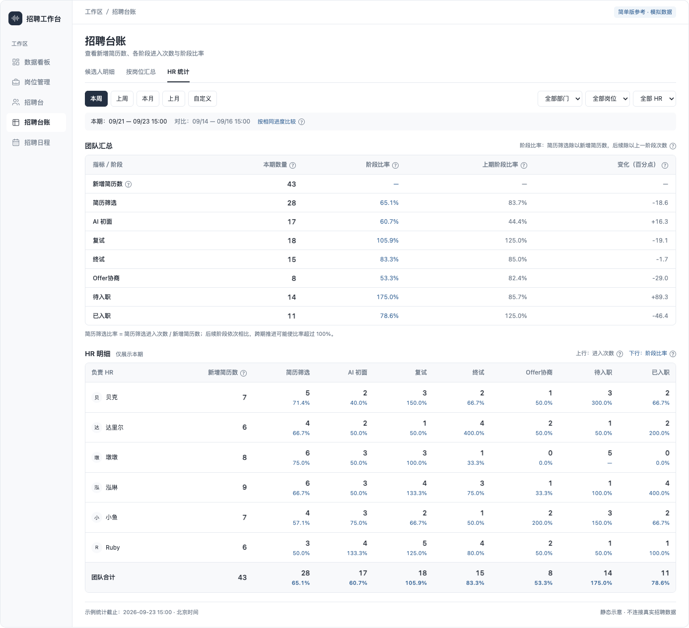

# 招聘台账 · HR 统计简单版方案

- 日期：2026-09-23
- 状态：已按本版方案开发；待在有招聘数据和登录态的环境联调验收。
- 参考：[原完整方案](2026-09-23-hr-performance-statistics.md)。原方案保留作为背景，本版按以下范围实施，不默认带入原版额外指标。
- 目标：快速查看各 HR 推进了多少招聘记录、相邻阶段的数量关系，为周度跟进和绩效复盘提供基础数据。

## 1. 指标范围：新增简历数与两项阶段指标

| 指标         | 定义                                                                               | 例子                                             |
| ------------ | ---------------------------------------------------------------------------------- | ------------------------------------------------ |
| 新增简历数   | 所选期间首次进入当前工作区简历库的简历条目数，单位为份；独立统计，不是流程阶段     | 本周新增入库 43 份简历，记 43 份                 |
| 进入阶段次数 | 所选期间，招聘记录首次实际进入该统计阶段的次数；同一招聘记录同一阶段只计一次       | 本周有 18 条记录首次进入复试，记 18 次           |
| 阶段比率     | 简历筛选进入次数 ÷ 同期新增简历数；其他阶段为本阶段进入次数 ÷ 同期上一阶段进入次数 | AI 初面 17 次、复试 18 次，复试阶段比率为 105.9% |

这里的“次数”沿用原方案的去重口径，表示招聘记录首次到达阶段，不表示每次按钮操作，也不累计回退后重复进入。两张表的数量单元格只显示数字，不附加“份／次”等单位；指标含义保留在表头与问号说明中。比率统一保留一位小数及百分号。

本版不展示完成次数、通过数、驳回数、放弃数、通过率、Offer 接受率、到岗率、当前积压、等待时长、招聘积分或自动绩效评分。

## 2. 页面只保留两张表

入口仍为：招聘台账 → HR 统计。

### 团队汇总

最前面增加“新增简历数”，其后按实际阶段逐行展示，列为：

**指标／阶段｜本期数量｜阶段比率｜上期阶段比率｜变化（百分点）**

“新增简历数”显示新增数量，其余阶段显示进入次数，数值均不带单位。新增简历数不展示阶段比率及比率比较；简历筛选展示本期比率、上期比率及百分点变化。

- 进入次数只突出本期值；其上期数量可放在说明或明细中，不另增加数量变化、增长率等列。
- 阶段比率保留团队上期比较，沿用此前已确认的范围规则。
- 两期分别计算阶段比率，再相减得到百分点变化，不用本期分子除以上期分母。

### HR 明细

一行一个 HR，各阶段横向并列，底部为团队合计。

- HR 姓名之后第一列为“新增简历数”，只显示“43”；之后从“简历筛选”开始展示各阶段。
- 阶段单元格仅两行：上方“18”，下方“105.9%”。表头统一说明两行分别代表进入次数与阶段比率。
- 所有阶段在同一张表展示，不提供阶段筛选或数量／比例切换。
- 只看本期；HR 行及其合计行都不展示上期值、增减或排名。
- 固定 HR 姓名列；窄屏允许横向滚动，不压缩到文字不可读。
- 团队比率用各 HR 总次数计算，不平均个人比率。

## 3. 阶段与计数

| 展示顺序 | 统计行     | 计数依据                                                                 |
| -------- | ---------- | ------------------------------------------------------------------------ |
| 1        | 新增简历数 | 本期首次新增到工作区简历库的简历条目数；独立统计，不是实际流程节点       |
| 2        | 简历筛选   | 首次实际进入筛选阶段的时间                                               |
| 3        | AI 初面    | 首次实际进入 AI 初面阶段的时间，与当前招聘台命名及阶段保持一致           |
| 4        | 复试       | 首次实际进入复试阶段的时间                                               |
| 5        | 终试       | 首次实际进入终试阶段的时间                                               |
| 6        | Offer协商  | 首次进入流水提供、谈薪、发 Offer、背调中的任一节点，作为一次整体协商进入 |
| 7        | 待入职     | 首次正式进入待入职的时间，不统计当前仍待入职的存量                       |
| 8        | 已入职     | 按已确认的实际入职日期计一次；不使用预计入职日期                         |

- 新增简历数的阶段比率显示“—”。简历筛选阶段比率＝同期简历筛选进入次数 ÷ 同期新增简历数；AI 初面比率＝同期 AI 初面进入次数 ÷ 同期简历筛选进入次数，后续依次除以上一实际阶段的进入次数。HR 行使用各自的数量，团队及合计行使用总数量计算。
- 简历筛选的上期比率＝上期简历筛选进入次数 ÷ 上期新增简历数；团队变化＝本期比率－上期比率，按百分点展示。例如本期 28 ÷ 43＝65.1%，上期 36 ÷ 43＝83.7%，变化为 -18.6 个百分点。
- 新增简历数的本版拟定口径：按首次成功进入工作区简历库的时间统计，每个简历条目只计一次；仅上传到简历池、解析失败、重复导入已有条目、更新已有简历均不增加。不得直接用新建招聘记录数替代；无简历的招聘记录不计新增简历。
- 新增简历归属首次入库时的负责 HR；岗位、部门按入库时关联的业务归属筛选，缺失归属单列“未分配”。后续复用到不同岗位不再累计新增简历。实施前核验这些历史字段是否可追溯。
- 新建记录直接从较后阶段开始，只计实际起始阶段；是否增加新增简历数独立判断，不补算被跳过的前序阶段。
- Offer 协商的四个子阶段之间推进，不增加整体进入次数；回退重进也不重复增加。
- 先确定记录在整个招聘生命周期中的首次有效进入，再按日期过滤；不能在每个时间窗口内重新取一次“首次”。
- 创建时尚未写入创建事件的原生招聘记录，可由首个阶段事件的来源阶段确定起始阶段；若从未发生阶段变化，则由当前阶段与创建时间还原。迁移旧记录仍需可核验的进入时间，不按当前阶段倒推。
- 阶段次数按招聘记录计算：同一个自然人应聘不同岗位形成不同招聘记录，分别计算；上传重复文件、刷新、重复请求不增加次数。

## 4. 时间与比较

- 默认本周，快捷操作：本周、上周、本月、上月、本季度、上季度、自定义。
- 按北京时间统计，自然周为周一至周日。日期范围包含首尾两天；今天只统计至当前刷新时刻。
- 保留部门、岗位、负责 HR 筛选，与日期筛选共同作用于两张表。
- 页面明确显示本期及对比期日期；只在团队汇总使用对比期数据。

| 选中范围                     | 团队汇总的对比范围                                       |
| ---------------------------- | -------------------------------------------------------- |
| 本周／本月／本季度未结束     | 上周／上月／上季度相同进度，精确到刷新时刻               |
| 完整自然周，包括自定义选中   | 前一个完整自然周                                         |
| 完整自然月，包括自定义选中   | 前一个完整自然月，不按 30／31 天倒推                     |
| 完整自然季度，包括自定义选中 | 前一个完整自然季度，不按固定天数倒推                     |
| 其他自定义范围               | 开始日期之前紧邻的等长自然日区间；含今天时只比较相同进度 |

例如 4 月 1—30 日对比 3 月 1—31 日；9 月 10—16 日对比 9 月 3—9 日。月、季度天数不同时展示实际日期；上期较短、无法达到相同进度时，比较截止时间截到上期末，不越界。

## 5. 最少但必要的口径说明

- **分母为 0**：阶段比率显示“—”；任一期分母为 0，团队百分点变化也显示“—”。
- **可以超过 100%**：本期后续阶段可能来自以前录入的记录；阶段跳过、HR 交接也可能造成数量差异。简历筛选还可能包含历史简历及同一简历对应的不同岗位招聘记录，因此筛选比率也可能超过 100%。比率不截断，不称为同批次转化成功率。
- **HR 归属**：新产生的进入事件记录当时负责 HR，后续转交不迁移这些历史数量。旧事件若无负责人快照，按招聘记录当前负责 HR 回填；这部分如发生过转交，历史绩效可能归属接手人，界面明确提示。旧事件缺岗位／部门快照时，筛选归属也按当前招聘记录及岗位关联补齐。
- **历史完整性**：归档或 HR 离职不抹去真实历史进入；缺失时间或归属时标明数据不足，不以 0 替代。
- **权限**：沿用现有招聘数据可见范围；部分权限下标注“可见范围合计”，不泄露全团队数据。
- **绩效使用**：这是推进数量及阶段数量比，不单独代表候选人质量或完整转化效率；本版不生成综合绩效分。

每项指标标题旁保留问号，hover／键盘聚焦／触屏点击可查看说明。新增简历数的表头单独放置问号；HR 表上方统一放置“进入次数”“阶段比率”两个说明，避免在每个单元格重复。

说明示例：

> 新增简历数：本期首次成功入库的简历条目数，单位为份；不等于进入简历筛选次数，重复导入已有条目不累计。
>
> 进入次数：按首次实际进入阶段的时间统计，同一招聘记录同一阶段只计一次；重复操作、回退重进不重复计数。
>
> 阶段比率：简历筛选进入次数 ÷ 同期新增简历数；其他阶段为本阶段进入次数 ÷ 同期上一阶段进入次数。点击或查看说明可见对应阶段与分子／分母；跨期推进可能超过 100%。

## 6. 必要交互与实施范围

1. 日期及业务条件筛选，更新团队汇总和 HR 明细。
2. 点击新增简历数查看新增简历条目、首次入库时间和当时归属；点击阶段次数查看对应招聘记录及首次进入时间、归属 HR；比例明细分别展示分子和分母，不仅取两者交集。
3. 实施前核验流程历史能否确定首次进入时间、Offer 合并阶段及当时负责 HR；能可靠还原的历史才参与统计。
4. 后端仅提供新增简历数、两项阶段指标、团队比较区间与必要明细；不因旧方案存在而额外实现其他统计。
5. 不包含导出、自动评分、定时推送和历史报表锁定。应用运行逻辑与权限边界沿用现有实现。

## 7. 验收标准

| 场景                            | 预期                                                                |
| ------------------------------- | ------------------------------------------------------------------- |
| 打开页面                        | 默认本周，仅有团队汇总和 HR 明细；新增简历数排在阶段统计之前        |
| 上周创建、本周首次进入复试      | 计入本周复试，不受创建时间限制                                      |
| 同一记录回退、重新进入复试      | 仍只记首次进入那一期的一次                                          |
| 在 Offer 协商内部推进四个子阶段 | 整体协商只计一次                                                    |
| 新建记录从复试开始              | 仅计复试阶段；简历若首次入库则另计新增简历，不虚构筛选／初面进入    |
| 同一简历复用到不同岗位          | 新增简历只计一次；阶段次数按各招聘记录独立计算                      |
| 数量展示                        | 团队及 HR 表均只显示数字，不附加份／次，比例保留百分号              |
| 新增简历 43、简历筛选 28        | 新增简历比率显示“—”；简历筛选比率为 65.1%，HR 按个人数量分别计算    |
| 上期新增简历 43、简历筛选 36    | 上期筛选比率为 83.7%；与本期 65.1% 比较为 -18.6 个百分点            |
| AI 初面 17、复试 18             | 阶段比率 105.9%，不强制压到 100%                                    |
| 本期比率 105.9%、上期 80.0%     | 团队变化 +25.9 个百分点；HR 不展示比较                              |
| 上一阶段为 0 或历史不足         | 分别显示“—”或“数据不足”，不混为零                                   |
| 自定义完整自然周／月／季度      | 与快捷选择同一周期得到相同对比范围                                  |
| HR 转交、归档、离职             | 新事件归属保留进入时 HR；旧事件无快照时按当前 HR 回填，说明这一限制 |
| 合计及明细核对                  | HR 次数合计＝团队次数；比率按总分子／总分母重算；明细可追溯         |

## 8. 静态参考图

数据为模拟，图示只用于确认信息布局；实际默认日期按当前时间计算。不要求像素级复刻。

