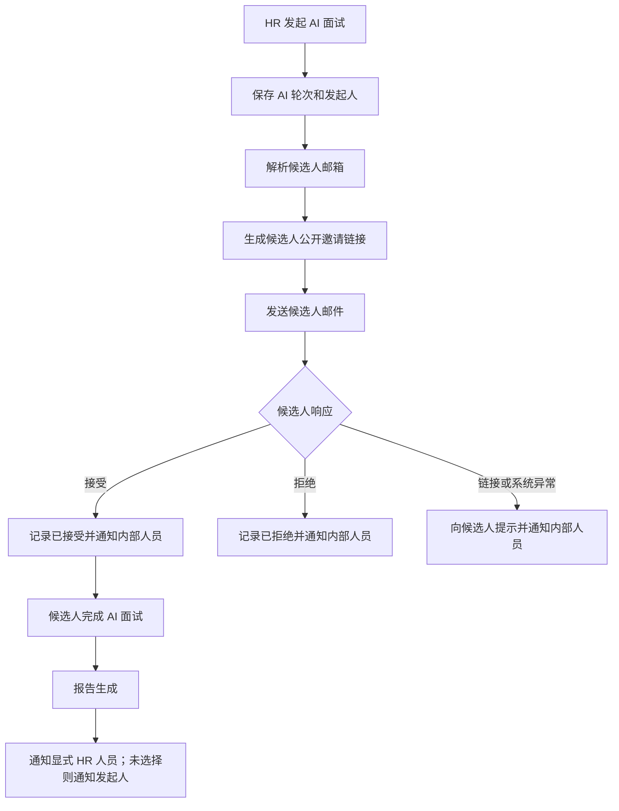
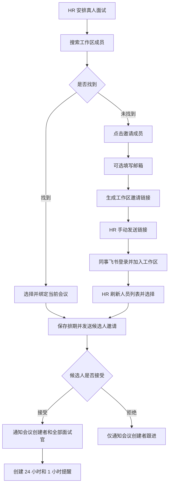

# 面试通知全流程 PRD

> 文档状态：已确认；Phase 1 核心闭环已实现，Phase 2/3 待继续
>
> 日期：2026-08-18（2026-08-26 按已跑通流程收口）
>
> 适用产品：AI Recruitment Copilot
>
> 需求来源：`飞书面试通知全流程.html`、产品讨论确认结论、当前代码能力核对
>
> 配套技术设计：[面试通知全流程技术设计](../plans/2026-08-18-interview-notification-flow-technical-design.md)

## 0. 实施状态（2026-08-26）

| 范围                 | 状态     | 当前交付                                                                                  |
| -------------------- | -------- | ----------------------------------------------------------------------------------------- |
| 通知事实与可靠发送   | 已实现   | 统一事件 outbox、delivery 租约、1/5/15 分钟重试、unknown/dead 状态、Worker 开关           |
| HR 内部接收人        | 已实现   | AI 流程支持显式人员选择；真人流程固定取会议 `createdBy`；有飞书则飞书，否则按邮箱发送     |
| AI 邀请与响应        | 已实现   | 独立候选人邀请 Token、邮件入口、接受/拒绝状态、内部飞书事件、完成与报告事件               |
| 真人面试通知         | 已实现   | 保存后先邀请候选人；候选人接受后直接通知会议创建者和已选面试官，并创建 24 小时/1 小时提醒 |
| 列表外面试官邀请     | 已实现   | 复用工作区成员邀请；邮箱可选，也可直接复制链接；同事飞书登录加入后刷新人员列表并选择      |
| 改期权限             | 已实现   | 本期仅具备真人面试更新权限的 HR 可改期；改期后通知创建者、面试官和候选人                  |
| 邮件与飞书发送       | 已实现   | Resend 与飞书 adapter、模板版本、渲染快照和可审计发送记录                                 |
| 短信发送             | 后续范围 | 当前候选人通知只启用邮件；保留渠道类型，但本期不接入短信供应商                            |
| 工作区模板维护页     | 待实现   | 当前为迁移内置默认模板；编辑、预览、测试、发布 UI 尚未交付                                |
| 运营查询与人工处理页 | 部分实现 | Worker 诊断端点和既有 Platform 能力可复用；统一事件筛选、unknown/dead 人工处理 UI 待补    |

生产环境默认不自动启用新发送链路；需同时开启 `INTERVIEW_NOTIFICATION_FLOW_ENABLED` 和 `INTERVIEW_NOTIFICATION_WORKER_ENABLED`，并先应用迁移、校验默认模板及供应商配置。

## 1. 文档结论

本期不建设“通知角色中心”，不引入候选人负责人、通知负责人、审批角色、升级角色等业务角色。系统直接维护流程中的具体人员关系：

- 候选人及其邮箱、手机号；
- 发起当前面试或轮次的具体用户；
- AI 流程显式选择的内部通知人员；
- 每场真人面试显式指定的面试官；
- 通过工作区邀请链接加入、之后可被选择的同事。

候选人不要求拥有飞书账号。当前候选人通知通过邮件和带有效期的公开链接完成；短信留到后续阶段。飞书只用于已绑定飞书的内部 HR 和真人面试官。

产品层不展示通用业务角色。底层分别保留登录账号、工作区成员关系和轮次级面试官指派；选择面试官必须复用现有 `user`，不会为同一位同事创建第二个账号。

## 2. 背景

当前产品已经具备部分面试通知能力：

- AI 面试报告生成后可向候选人记录的创建者发送飞书或邮件通知；
- 真人面试可以选择工作区成员作为面试官；
- 真人面试可以创建 LiveKit 链接，并可选同步飞书会议和日程；
- 候选人和面试官可以通过公开链接进入真人面试；
- AI 轮次邀请邮件通过 Resend 发送并留存日志；
- 工作区已有成员邀请及邀请接受页面；
- Platform 已有飞书通知发送记录、预览和重发入口。

但这些能力尚未形成统一的面试通知流程，主要问题包括：

1. 通知接收人主要从候选人记录创建者推断，HR 不能稳定地指定具体接收人员。
2. 候选人没有飞书账号，但原流程描述没有明确区分候选人渠道和内部渠道。
3. 真人面试官从工作区成员中选择，但排期页面缺少就地邀请成员和刷新列表的入口。
4. 通知模板、触发事件、失败重试和发送记录分散在不同模块中。
5. “进入下一轮”和“下一轮安排完成并通知”没有形成清晰的产品边界。

## 3. 问题定义

产品需要回答五个稳定问题：

1. 发生了什么业务事件？
2. 这次事件应该通知哪些具体人员？
3. 每个人通过哪个渠道接收？
4. 使用哪一版本的通知内容？
5. 通知是否真正发送成功，失败后如何恢复？

目标模型为：

```text
业务事件
  → 解析具体人员
  → 解析可用渠道
  → 选择模板版本
  → 生成发送任务
  → 发送与重试
  → 留存可审计结果
```

## 4. 产品目标

### 4.1 核心目标

- 建立从 AI 首轮、真人复试到后续轮次的统一通知流程。
- 候选人本期通过邮件和公开链接参与，不依赖飞书身份；短信后续接入。
- AI 流程可以显式选择接收飞书通知的内部人员；未选择时回退到 AI 面试发起人。
- 真人流程不再选择额外 HR 通知人员，固定通知会议 `createdBy`。
- HR 可以在真人面试排期时直接选择或邀请具体面试官。
- 本期由 HR 统一协调并执行改期。
- 通知流程和具体文案可以在管理页面维护、预览和测试。
- 每次发送都可追踪、可重试、可解释，避免重复通知和静默失败。

### 4.2 成功标准

- 所有关键面试事件均能解析到明确的通知对象和渠道。
- 不再依赖“候选人负责人”或其他未实现业务角色完成通知路由。
- 候选人没有飞书账号时不影响邀请、确认、提醒、改期和取消通知。
- 面试官不在系统人员列表时，HR 能在当前流程内生成工作区邀请链接，待其加入后刷新选择。
- 发送失败经过 1、5、15 分钟三次重试后进入人工处理队列。
- 同一业务事件不会因为接口重试或重复回调产生正常情况下的重复通知。

## 5. 非目标

以下内容不纳入本期：

- 通用业务角色中心或角色绑定规则引擎；
- 候选人飞书账号绑定；
- 自动语音电话外呼；
- 候选人自主发起改期；
- 面试官或候选人自行改期、改期提议、超时仲裁等协商状态机；
- 审批流、升级通知和跨工作区通知；
- 根据组织架构自动寻找上级或部门负责人；
- 用飞书会议替代 LiveKit；
- 让邀请链接本身永久拥有改期权限；
- 自动将历史通知完整回填为新事件模型。

## 6. 用户与直接人员关系

### 6.1 候选人

候选人至少维护以下联系信息：

- 姓名；
- 邮箱；
- 手机号；
- 邮箱是否有效；
- 手机号是否有效；
- 通知语言，V1 默认简体中文。

候选人不需要登录工作区，也不需要飞书 Open ID。候选人本期通过邮件中的公开链接完成；短信仅作为后续渠道规划：

- 查看邀请；
- 接受或拒绝邀请；
- 查看面试时间和说明；
- 进入 AI 面试或真人面试；
- 查看改期、取消和完成结果。

### 6.2 面试发起人

面试发起人是执行“发起 AI 面试”“确认真人面试安排”等明确动作的用户。

发起人必须在业务动作发生时保存，不应在发送通知时从可变状态反推：

```text
AI 面试发起人 = 发起该 AI 轮次的用户
真人面试发起人 = 创建或确认该真人面试会议的用户
```

历史数据缺少发起人时，才允许使用候选人记录的 `createdBy` 兼容。

### 6.3 HR 内部通知人员

HR 可以在发起 AI 面试时选择接收内部消息的具体账号。真人面试不再维护额外 HR 通知人员，固定使用会议 `createdBy`。

接收人解析顺序固定为：

```text
AI 显式选择的内部账号
  → 如果一个都没有选择：AI 轮次发起人
  → 仅用于旧 AI 数据：候选人记录创建者

真人会议：会议 createdBy
```

规则：

- 只有“完全未选择”时才回退到发起人。
- 对每个已选择账号独立解析渠道：存在有效飞书绑定则发送飞书；否则使用该账号的有效邮箱；两者都没有时记录不可达并提示。
- 渠道回退只发生在同一个账号内，不会把通知改发给候选人创建者或其他人员。
- 同一用户被重复选择时只发送一次。
- 选择结果按候选人招聘记录保存，后续轮次默认沿用，HR 可调整。

### 6.4 真人面试官

每场真人面试直接保存具体面试官。

- 产品不提供通用“面试官角色中心”。
- `studio_human_interview_round_interviewer` 保存轮次面试官指派，会议参与人沿用同一批已选工作区用户。
- HR 保存安排表示面试官时间已经线下协调，本期不要求面试官再次确认。
- 会议内部仍可保留技术性的主持人、面试官、观察者字段，以支持 LiveKit/飞书能力，但不作为工作区级业务角色展示。
- 第一位已选面试官可作为技术主持人。

## 7. 核心用户旅程

### 7.1 AI 面试邀请



### 7.2 真人面试安排与邀请新面试官



### 7.3 改期

本期由 HR 提交新时间。新时间立即保存，不创建新的轮次记录；候选人和面试官通过通知获知调整结果，不增加二次确认状态机。

改期完成后：

- `scheduleVersion + 1`，旧提醒取消；
- 候选人收到改期邮件；
- 所有当前指定面试官收到飞书，未绑定飞书但有邮箱的人员收到邮件；
- 会议 `createdBy` 收到内部通知；
- 按新时间重新创建尚未错过的提醒；
- 系统记录原时间、新时间、修改人、修改原因和每个渠道的发送结果。

## 8. 页面需求

### 8.1 面试通知设置页

建议入口：`工作区设置 → 面试通知`。

页面包含两个区域：

1. 流程规则
   - 展示事件、通知对象、渠道、发送时机和启用状态；
   - 可启用或停用某个渠道；
   - 可配置提醒时间，V1 默认面试前 24 小时和 1 小时；
   - 不提供业务角色选择器。
2. 通知模板
   - 按事件、对象和渠道编辑标题与正文；
   - 展示允许使用的变量；
   - 支持示例数据预览；
   - 支持发送测试消息；
   - 发布后生成新版本，不覆盖历史发送快照。

现有 Platform 飞书通知页继续作为运营调试和重发页面，不承担工作区模板配置职责。

### 8.2 AI 面试发起区

新增或明确以下字段：

- 候选人邮箱；
- 候选人手机号；
- HR 飞书通知人员，可多选；
- 未选择时的提示：“未选择时将通知本次面试发起人”；
- 将发送的候选人渠道预览；
- 通知文案预览入口。

### 8.3 真人面试安排弹窗

面试官选择区域需要支持：

- 搜索工作区成员；
- 展示真实的飞书绑定状态；
- 未找到时直接打开现有“邀请成员”能力；
- 邀请邮箱可选：填写时发送邀请邮件，不填写时只生成可复制链接；
- 对方通过链接完成飞书登录并加入工作区后，HR 可刷新列表并选择；
- 已选择人员只展示通知可达性，不展示内部确认状态。

建议状态文案：

| 状态             | 页面文案                           | 能否选择与保存 |
| ---------------- | ---------------------------------- | -------------: |
| 已加入并绑定飞书 | 已绑定飞书                         |             是 |
| 已加入未绑定飞书 | 未绑定飞书，将使用账号邮箱         |             是 |
| 未加入工作区     | 此人不在列表，请先邀请，加入后刷新 |             否 |

### 8.4 工作区邀请接受页

- 复用现有 `/join/:code` 页面；
- 展示工作区与邀请人信息，不携带候选人或面试内容；
- 未登录时引导飞书登录；
- 接受后成为工作区成员，并给邀请创建者发送飞书通知；
- HR 回到排期弹窗刷新列表，再显式选择该成员作为面试官。

### 8.5 面试官会议页

已指定面试官可以：

- 查看当前会议必要信息；
- 查看候选人最小必要信息；
- 进入会议；
- 填写面试评价。

不能查看或修改：

- 其他未参与会议；
- 全部候选人库；
- 工作区成员和权限；
- 通知模板；
- 与本场无关的招聘资料。

### 8.6 发送记录与异常处理

发送记录需要展示：

- 业务事件；
- 候选人和轮次；
- 接收人；
- 渠道；
- 使用的模板版本；
- 状态；
- 已重试次数；
- 供应商消息 ID；
- 失败原因；
- 创建、发送和最后更新时间；
- 人工重发入口。

## 9. 轮次流转与通知矩阵

### 9.1 核心原则

状态变化不等于立即通知候选人。

```text
进入真人面试阶段
  → 待安排
  → 选择时间与面试官
  → HR 保存排期并发送候选人邀请
  → 候选人接受
  → 通知会议 createdBy 和全部已选面试官
  → 创建 T-24h / T-1h 提醒
```

“待安排”不通知候选人。HR 保存排期即表示已与面试官协调好时间，不存在面试官二次确认；候选人接受后，本场安排正式生效并创建提醒。

轮次口径：AI HR 初面固定是第一轮；之后仅“已完成且通过”的真人轮次占用第二、第三……业务轮次。取消、未开始或未完成的真人记录不占新的成功轮次。页面和通知展示本次业务记录的轮次标签，不用数据库记录数直接推断轮次。

### 9.2 V1 通知矩阵

| 事件               | 触发条件                         | 候选人                 | 指定面试官             | 内部 HR                       |
| ------------------ | -------------------------------- | ---------------------- | ---------------------- | ----------------------------- |
| AI 面试已发起      | HR 确认发起                      | 邮件：邀请与公开链接   | 不通知                 | 飞书优先、账号邮箱兜底        |
| 候选人接受 AI 邀请 | 候选人点击接受                   | 页面确认               | 不通知                 | 飞书优先、账号邮箱兜底        |
| 候选人拒绝 AI 邀请 | 候选人点击拒绝                   | 页面确认               | 不通知                 | 飞书优先、账号邮箱兜底        |
| AI 邀请异常        | 链接失效、响应冲突或系统异常     | 页面提示并发送异常邮件 | 不通知                 | 飞书异常告警                  |
| AI 面试已完成      | 会话正常结束                     | 不额外通知             | 不通知                 | 飞书：等待报告                |
| AI 报告已生成      | 报告持久化且可访问               | 不发送内部报告         | 不通知                 | 飞书：评价摘要与详情链接      |
| AI 报告生成失败    | 转录或报告达到失败条件           | 不通知                 | 不通知                 | 飞书：失败与处理建议          |
| 进入真人面试待安排 | HR 明确推进                      | 不通知                 | 不通知                 | 页面状态，不额外推送          |
| 真人候选人邀请     | HR 保存完整排期                  | 邮件：接受/拒绝入口    | 不通知                 | 不额外推送                    |
| 候选人接受真人邀请 | 候选人点击接受                   | 页面确认               | 飞书优先、账号邮箱兜底 | 仅会议 `createdBy`            |
| 候选人拒绝真人邀请 | 候选人点击拒绝                   | 页面确认               | 不通知                 | 仅会议 `createdBy`            |
| 真人邀请异常       | 链接失效、响应冲突或系统异常     | 页面提示并发送异常邮件 | 不通知                 | 仅会议 `createdBy` 告警       |
| 真人面试提醒       | 达到 T-24h / T-1h                | 邮件                   | 飞书优先、账号邮箱兜底 | 仅会议 `createdBy`            |
| 真人面试改期       | 有更新权限的 HR 完成修改         | 邮件：新旧时间和入口   | 飞书优先、账号邮箱兜底 | 仅会议 `createdBy`            |
| 真人面试取消       | 有更新权限的 HR 确认取消         | 邮件：原时间与取消说明 | 飞书优先、账号邮箱兜底 | 仅会议 `createdBy`            |
| 真人会议结束       | 主持人结束会议                   | 不额外通知             | 不额外通知             | 只关闭入口并取消待发提醒      |
| 真人轮次完成与评价 | HR 标记轮次完成                  | 不通知内部评价         | 不通知                 | 仅会议 `createdBy` 收累计评价 |
| 进入后续真人轮次   | 上一真人轮次已完成且通过后再发起 | 待安排时不通知         | 待安排时不通知         | 页面状态，不额外推送          |

第三轮及以后复用真人面试事件，不复制新的固定流程代码。

## 10. 通知内容管理

一条模板由以下维度确定：

```text
工作区 + 事件 + 通知对象类型 + 渠道 + 语言
```

通知对象类型只描述直接关系，不描述业务角色：

- `candidate`：候选人；
- `selected_hr_users`：AI 流程显式选择的内部通知人员；
- `initiator_fallback`：未选择 HR 人员时的发起人；
- `meeting_interviewers`：当前会议指定面试官。

模板变量至少包括：

```text
{{candidateName}}
{{jobName}}
{{companyName}}
{{roundName}}
{{interviewType}}
{{interviewStartTime}}
{{interviewEndTime}}
{{oldInterviewStartTime}}
{{oldInterviewEndTime}}
{{timeZone}}
{{interviewLink}}
{{initiatorName}}
{{interviewerNames}}
{{operatorName}}
{{changeReason}}
{{deadline}}
{{supportContact}}
```

规则：

- 只允许使用白名单变量；
- 候选人模板不得包含内部评价、报告、淘汰理由和内部备注；
- 邮件可使用按钮和结构化布局；
- 短信渠道保留为后续能力，本期不产生短信 delivery；
- 飞书使用结构化消息卡片；
- 保存草稿不影响线上发送；
- 发布后生成不可变版本；
- 每次发送保存实际渲染内容快照。

## 11. 权限规则

### 11.1 产品规则

```text
canReschedule(meeting, actor) =
  actor 具备现有 HR 真人面试更新权限
```

面试官和候选人本期不能直接改期；他们通过线下协商联系 HR，由 HR 在 Studio 中统一修改。

### 11.2 最小权限

邀请新面试官时先复用工作区成员邀请。加入工作区本身不会自动成为面试官，仍需 HR 在本次轮次中显式选择；会议资料访问继续按轮次/会议指派校验。

### 11.3 审计

以下操作必须留审计记录：

- 发起面试；
- 修改 HR 通知人员；
- 生成工作区邀请链接、成员加入和刷新选择；
- 增加或移除面试官；
- 改期和取消；
- 修改和发布通知模板；
- 人工重发通知。

## 12. 异常与恢复

### 12.1 发送失败

- 第一次失败后 1 分钟重试；
- 第二次失败后 5 分钟重试；
- 第三次失败后 15 分钟重试；
- 最终失败进入人工处理队列；
- 无接收人、无有效联系方式、无模板、无会议链接等数据错误不进行无意义重试，直接要求人工处理。

### 12.2 候选人响应异常

- 链接失效：提示联系 HR，并给内部人员告警；
- 重复提交相同响应：幂等返回成功；
- 已接受后再拒绝或已拒绝后再接受：提示状态冲突，不覆盖原响应；
- 系统异常：保留请求追踪 ID，不能展示空白页。

### 12.3 工作区邀请异常

- 邀请链接只绑定工作区，不绑定候选人或会议；
- 邮箱只是可选的发送渠道，不作为飞书登录账号匹配条件；
- 链接禁用后不能再加入；
- 已加入成员需要 HR 刷新列表并显式选择，不能自动进入任何面试。

### 12.4 报告异常

- 转录或报告生成超时后通知内部人员；
- 支持重新生成和人工补录；
- AI 报告失败不得自动改变候选人招聘结论；
- 只有 HR 明确操作才能推进、保留或淘汰候选人。

## 13. 非功能需求

### 13.1 安全

- 所有公开 Token 带有效期，只在数据库保存哈希；
- 权限修改接口必须要求登录并校验工作区及实体关系；
- 邮箱、手机号和通知正文不得写入普通应用日志；
- 页面和运营记录对联系方式进行脱敏；
- 模板不允许执行任意脚本或服务端表达式。

### 13.2 一致性和幂等

- 业务状态与通知事件在同一数据库事务中落库；
- 同一业务事件使用稳定去重键；
- 每个事件、接收人和渠道最多存在一个活动发送记录；
- 供应商超时后的状态必须区分确定失败和结果未知。

### 13.3 可观察性

- 可以按工作区、候选人、事件、渠道、状态和时间查询；
- 记录模板版本、重试次数、失败原因和供应商消息 ID；
- 提供待处理和最终失败数量；
- Platform 可人工预览和重发，但重发必须复用同一业务事件和模板快照策略。

### 13.4 时间

- 数据库存储 UTC；
- 模板渲染时使用工作区时区，当前默认 `Asia/Shanghai`；
- 所有 API 时间必须包含明确时区；
- 改期后取消旧提醒并根据新时间重新生成提醒。

## 14. 数据指标

上线后至少观测：

- 各事件生成数量；
- 各渠道首次发送成功率；
- 三次重试后的最终成功率；
- 从事件发生到首次成功发送的 P50/P95 时延；
- 缺少联系方式、飞书绑定、模板或链接的阻断数量；
- 重复发送率；
- 工作区邀请链接创建、邮件发送和成员加入数量；
- 候选人邀请接受率和拒绝率；
- HR 改期操作数量；
- 最终进入人工处理的通知比例。

建议首期目标：

- 有效联系方式下的关键通知最终发送成功率不低于 99%；
- 即时通知 P95 在 5 分钟内首次送达或进入明确失败状态；
- 正常业务请求的重复通知率低于 0.1%；
- 越权改期成功数为 0。

## 15. 验收标准

### 15.1 候选人通知

- 候选人无飞书账号，仅有邮箱和手机号时，可以完整收到 AI 邀请、真人面试确认、提醒、改期和取消通知。
- 候选人点击接受或拒绝后，页面展示明确结果，HR 收到飞书消息。
- 候选人无法看到内部评价和 AI 报告。

### 15.2 HR 通知人员

- 选择两位飞书用户后，两位都收到通知，发起人不额外收到兜底通知。
- 未选择任何人时，仅解析当前面试发起人。
- 选择了未绑定飞书但有邮箱的人时发送邮件；两种渠道都不可用时页面明确提示，且不改发给候选人创建者。

### 15.3 面试官邀请

- 搜索不到人员时可以生成工作区邀请链接，邮箱可填可不填。
- 对方通过链接完成飞书登录并加入工作区后，邀请创建者收到飞书通知。
- HR 刷新人员列表后可以选择新成员作为面试官。
- HR 保存排期即表示面试官时间已协调，不要求面试官再次确认。

### 15.4 改期

- HR 可以修改会议时间。
- 面试官和候选人不能直接修改时间。
- 改期保存后旧提醒取消，并按新时间重新创建尚未错过的提醒。

### 15.5 模板与发送记录

- 工作区可以编辑、预览、测试和发布模板。
- 历史发送记录继续显示当时的模板版本和渲染快照。
- 失败按 1、5、15 分钟重试，最终失败可人工重发。
- 重复触发同一业务事件不会生成重复活动通知。

## 16. 发布范围建议

### Phase 1：人员关系和核心发送闭环

- 保存发起人和 HR 显式通知人员；
- 候选人邮件通知；
- 真人面试官搜索、工作区邀请、刷新选择和会议绑定；
- HR 改期；
- 邀请、确认、改期、取消、AI 报告等核心事件；
- 通知事件、发送记录、幂等和三段重试。

### Phase 2：通知维护页面和运营能力

- 工作区流程矩阵和模板编辑；
- 模板版本、测试发送和预览；
- Platform 统一查询、人工重发和失败处理；
- 指标与告警。

### Phase 3：体验增强

- 更多语言；
- 候选人提出改期申请；
- 更精细的提醒策略；
- 企业短信短链和送达回执；
- 在业务确有需要时，再评估通知角色和工作区角色绑定。

## 17. 已确认决策

1. 候选人不使用飞书，本期使用邮件和公开链接；短信后续接入。
2. HR 可以显式选择飞书人员；未选择时回退到面试发起人。
3. AI 面试发起人暂定为明确发起该 AI 面试的创建者。
4. 当前不建设业务角色中心。
5. 真人面试直接指定具体面试官。
6. 找不到面试官时复用工作区成员邀请，邮箱可选，也可直接复制链接。
7. 同事通过链接飞书登录加入工作区后，HR 刷新人员列表并显式选择。
8. HR 选择并保存面试官即代表时间已线下协调，不要求面试官再次确认。
9. 本期仅 HR 可以改期；候选人和面试官通过线下协商联系 HR。
10. 真人面试 HR 通知固定发送给会议 `createdBy`，不再选择额外 HR 通知人员。
11. 工作区成员身份不能替代轮次/会议级权限校验，加入工作区不会自动成为面试官。

## 18. 实施依赖但不阻塞产品基线的事项

以下是实施选型，不改变本 PRD 的产品结论：

- 短信供应商、签名、模板报备和短链服务；
- 邮件域名和 Resend 生产发送域名验证；
- 飞书应用可见范围及内部人员 Open ID 解析；
- 工作区时区配置入口；
- 通知数据保留周期和合规策略；
- 生产环境 Worker、副本数和告警阈值。
