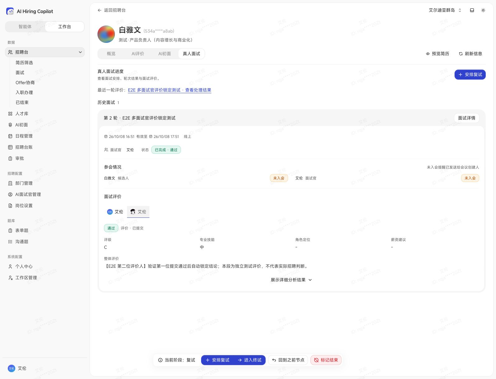
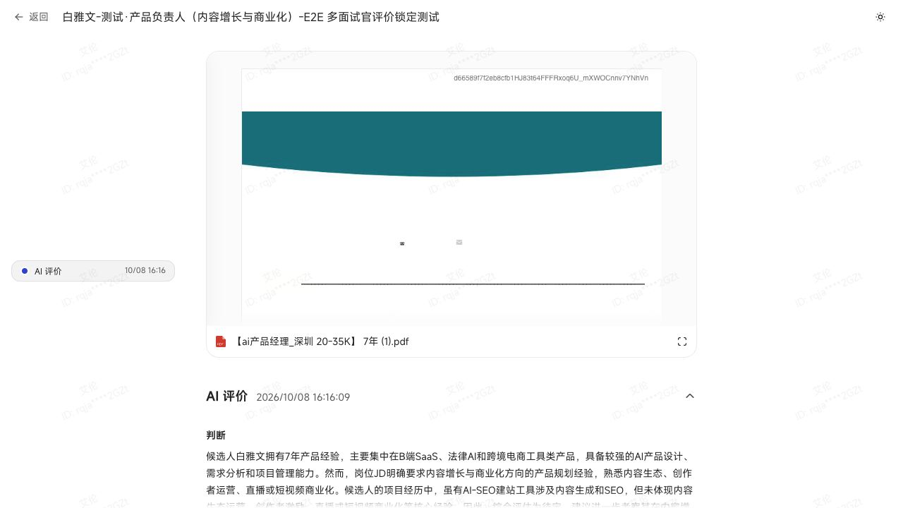
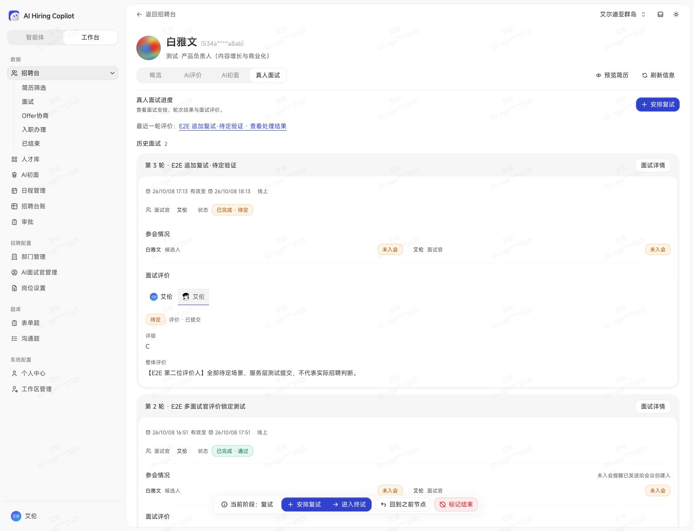

# 真人面试浏览器 E2E（2026-10-08）

使用用户指定的本地候选人页面和当前登录态执行真实 UI 操作，未修改数据库来跳过流程。

## 测试记录

- 工作区：`allen`。
- 招聘记录：`534a95c7-2ac4-4850-ab1b-adb66622a8ab`。
- 新建轮次：`7f0e923d-35ec-46fe-a600-cda8186a845f`，标签「E2E 多面试官评价锁定测试」。
- 新建会议：`97222715-ca02-4844-be62-0a4bfbb88ea9`。
- 原记录在未完成的 AI 初面，通过页面回退到简历筛选，再直接推进复试。
- 会议已结束，轮次已完成（测试结论通过），招聘记录仍处于复试。没有推进终试。
- 两份评价均明确注明 E2E 测试，不代表实际招聘判断。测试数据保留供用户检查。

## 已通过

1. 正常 UI 回退节点、直接推进复试、创建真人面试、生成候选人与面试官入口、结束会议。
2. 无录音场景下可以人工填写评价，保存草稿后关闭并重开，内容完整恢复。
3. 招聘端账号先提交通过、评级 B、技能良。
4. 所选面试官的邀请入口对应另一个账号（两者显示名均为艾伦）。其个人表单为空，结论自动选中通过且不可修改，其他字段仍可编辑。
5. 第二账号保存并提交独立评价，评级 C、技能中，结论沿用通过。
6. 候选人详情显示两个面试官 Tabs，切换后评级、技能、评价正文分别对应两位作者，首份内容未被覆盖。
7. DOM 实测头像宽高为 18×18 CSS px，结论 Badge 与「评价 · 已提交」共用同一 flex 行；截图确认排版。
8. 第二账号重新访问后评价为只读，没有再次提交按钮。页面显示「已同步到飞书评价表」（仅验证同步状态和文档链接，未打开外部文档核对正文）。
9. 只读数据库核对：会议 ended；轮次 completed/pass；2 份已提交评价、2 个不同 reviewer_id。

## 发现的问题与范围限制

- **排期限制**：工作区两位同名成员无法同时选中。现有代码要求共同飞书应用，第二成员不满足时置灰，UI 没有解释置灰原因。本次双身份评价改用招聘端当前账号 + 单独邀请的面试官完成，未覆盖两位正式排期面试官同时入会。
- **飞书日程同步失败**：创建成功后页面提示同步失败。数据库错误为「以下人员未找到飞书账号：艾伦」。会后评价表同步显示成功，两者是不同链路。
- **内置浏览器入会失败及提示缺失**：关闭麦克风、保持摄像头关闭后点击进入会议，LiveKit 报 `RTCPeerConnection.setConfiguration` 配置修改不受支持；页面随后只显示候选人资料，没有清晰的持续错误提示或重试入口。未完成真实音视频、录制、转录及 AI 生成 E2E。未使用其他浏览器验证，当前工具仅有内置浏览器。
- **提交后的会后页面状态异常**：邀请入口提交第二份评价成功后回到显示「进入会议」的准备页，虽然会议已结束。刷新恢复只读评价页。本次未尝试再次入会。
- 未在 UI 重跑「先不通过」「全部待定」「并发相反结果」等组合；这些仍以此前数据库及组件回归测试为依据，不能算作本次浏览器 E2E 已覆盖。

## 截图

## 追加多轮与结论矩阵验证

用户授权增加复试及使用本地环境准备状态后，追加以下验证：

- 浏览器创建第 3 轮「E2E 追加复试·待定验证」，轮次 `59a1e39a-3507-4a63-b8e5-4fba771c24f4`，会议 `d89f3a4c-e61b-4a09-b3f1-33b32af4ac47`。
- 通过 web 环境配置连接本地数据库，仅将该测试会议由 scheduled 改为 ended，以跳过已知内置浏览器音视频问题。这一步不是 UI 结束会议测试。
- 浏览器打开新轮次评价，表单没有继承上一轮通过。选择待定，缺少评级时正确阻止提交；补充 C 评级后提交成功。
- 使用真实评价 DAO 为受邀的第二账号提交独立待定评价；完成通知依赖替换为 no-op，其余保存、轮次汇总、招聘流程和文档同步任务逻辑正常执行。此步骤是服务与数据库集成验证，不计作第二账号浏览器操作。
- 数据库确认新轮次 completed/inconclusive，招聘记录保持 second_interview/in_pipeline；测试评价明确注明非真实招聘判断。
- 独立测试数据库新增 6 项真实事务回归：待定→通过、待定→不通过、全部待定、通过→相反输入、不通过→相反输入、两人并发相反输入。共 10 项测试通过。
- 并发提交验证：两份评价正文保留，最终结论一致，仅一次完成通知及一个文档同步任务。首个待定不锁定，首个拒绝在其他人未提交时不关闭招聘记录。
- Server typecheck、变更测试文件 lint/format 通过。独立数据库测试数据自动清理；本地第 3 轮保留供检查。
- 浏览器刷新后显示「历史面试 2」，第 3 轮「已完成 · 待定」，安排复试重新可用。切换第二面试官 Tab 正确显示第二份独立正文；空字段标签不显示。

